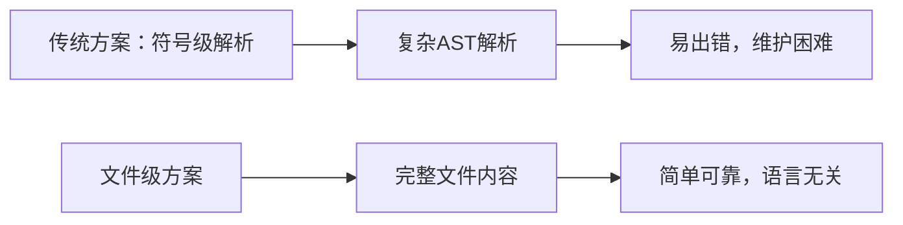

# 文件级向量化指南

## 概述

本指南介绍 grape-mcp-devtools 的**文件级向量化**策略，这是一种高效、简洁的文档向量化方案，避免了复杂的代码解析，而是以完整文件为粒度进行向量化存储。

## 核心设计理念

### 1. 文件级粒度的优势



**优势对比**：

| 特性 | 符号级解析 | 文件级向量化 |
|------|------------|--------------|
| **实现复杂度** | 高（需要AST解析器） | 低（文件读取+向量化） |
| **语言支持** | 每种语言需要专门实现 | 语言无关 |
| **维护成本** | 高（语法变化需要更新） | 低（依赖文档生成工具） |
| **搜索准确性** | 精确但不完整 | 全面且上下文丰富 |
| **错误率** | 高（解析失败） | 低（文件读取稳定） |

### 2. 树形结构保持

```text
包结构映射到向量空间：
github.com/gin-gonic/gin/v1.9.1/
├── gin.go                 → Vector + Metadata{path: "gin.go"}
├── context.go             → Vector + Metadata{path: "context.go"}  
├── middleware/
│   ├── logger.go         → Vector + Metadata{path: "middleware/logger.go"}
│   └── recovery.go       → Vector + Metadata{path: "middleware/recovery.go"}
└── binding/
    ├── binding.go        → Vector + Metadata{path: "binding/binding.go"}
    └── json.go           → Vector + Metadata{path: "binding/json.go"}
```

## 数据结构设计

### 文件级文档片段

```rust
#[derive(Debug, Clone, Serialize, Deserialize)]
pub struct FileDocumentFragment {
    /// 全局唯一标识符
    pub id: String,
    
    /// 包基本信息
    pub package_name: String,
    pub version: String,
    pub language: String,
    
    /// 文件信息
    pub file_path: String,
    pub content: String,
    pub hierarchy_path: Vec<String>,
    
    /// 元数据
    pub metadata: FileMetadata,
}

#[derive(Debug, Clone, Serialize, Deserialize)]
pub struct FileMetadata {
    /// 文件大小（字节）
    pub file_size: usize,
    /// 最后修改时间
    pub last_modified: Option<SystemTime>,
    /// 文件类型（source/test/example/doc）
    pub file_type: FileType,
    /// 编码格式
    pub encoding: String,
    /// 语言特定信息
    pub language_metadata: serde_json::Value,
}

/// 文件ID生成规则
impl FileDocumentFragment {
    pub fn generate_id(language: &str, package: &str, version: &str, file_path: &str) -> String {
        format!("{}/{}/{}/{}", language, package, version, file_path)
    }
}
```

### 向量元数据设计

```rust
#[derive(Debug, Clone, Serialize, Deserialize)]
pub struct FileVectorMetadata {
    /// 原文档ID
    pub doc_id: String,
    
    /// 层次信息
    pub language: String,
    pub package_name: String,
    pub version: String,
    pub file_path: String,
    pub hierarchy_path: Vec<String>,
    
    /// 内容摘要
    pub keywords: Vec<String>,
    pub content_hash: String,
    pub content_length: usize,
    
    /// 时间戳
    pub created_at: SystemTime,
    pub updated_at: SystemTime,
}
```

## 向量化流程

### 1. 文件内容预处理

```rust
pub struct FileVectorizer {
    embedding_client: Arc<dyn EmbeddingClient>,
    config: VectorizationConfig,
}

impl FileVectorizer {
    /// 文件级向量化的核心方法
    pub async fn vectorize_file(&self, fragment: &FileDocumentFragment) -> Result<DocumentVector> {
        // 1. 构建向量化文本
        let vectorization_text = self.build_vectorization_text(fragment)?;
        
        // 2. 文件分块（如果需要）
        let chunks = if vectorization_text.len() > self.config.max_file_size {
            self.chunk_large_file(&vectorization_text, fragment)?
        } else {
            vec![vectorization_text]
        };
        
        // 3. 批量向量化
        let embeddings = self.vectorize_chunks(&chunks).await?;
        
        // 4. 合并向量（如果有多个分块）
        let final_vector = if embeddings.len() == 1 {
            embeddings.into_iter().next().unwrap()
        } else {
            self.merge_chunk_vectors(embeddings)?
        };
        
        // 5. 构建最终向量对象
        Ok(DocumentVector {
            data: final_vector,
            dimension: self.config.vector_dimension,
            metadata: FileVectorMetadata {
                doc_id: fragment.id.clone(),
                language: fragment.language.clone(),
                package_name: fragment.package_name.clone(),
                version: fragment.version.clone(),
                file_path: fragment.file_path.clone(),
                hierarchy_path: fragment.hierarchy_path.clone(),
                keywords: self.extract_keywords(fragment),
                content_hash: self.calculate_content_hash(&fragment.content),
                content_length: fragment.content.len(),
                created_at: SystemTime::now(),
                updated_at: SystemTime::now(),
            },
        })
    }
    
    /// 构建用于向量化的文本
    fn build_vectorization_text(&self, fragment: &FileDocumentFragment) -> Result<String> {
        let text = format!(
            "Package: {}\nVersion: {}\nLanguage: {}\nFile: {}\n\n{}",
            fragment.package_name,
            fragment.version,
            fragment.language,
            fragment.file_path,
            fragment.content
        );
        
        Ok(text)
    }
    
    /// 大文件分块策略
    fn chunk_large_file(&self, content: &str, fragment: &FileDocumentFragment) -> Result<Vec<String>> {
        let chunk_size = self.config.chunk_size;
        let overlap = self.config.chunk_overlap;
        
        let mut chunks = Vec::new();
        let mut start = 0;
        
        while start < content.len() {
            let end = std::cmp::min(start + chunk_size, content.len());
            let chunk = &content[start..end];
            
            // 为每个分块添加上下文信息
            let chunk_with_context = format!(
                "Package: {} | File: {} | Chunk: {}\n\n{}",
                fragment.package_name,
                fragment.file_path,
                chunks.len() + 1,
                chunk
            );
            
            chunks.push(chunk_with_context);
            
            if end >= content.len() {
                break;
            }
            
            // 处理重叠
            start = end - overlap;
        }
        
        Ok(chunks)
    }
    
    /// 合并多个分块的向量
    fn merge_chunk_vectors(&self, vectors: Vec<Vec<f32>>) -> Result<Vec<f32>> {
        if vectors.is_empty() {
            return Err(anyhow!("无法合并空向量列表"));
        }
        
        let dimension = vectors[0].len();
        let mut merged = vec![0.0; dimension];
        
        // 简单平均合并
        for vector in &vectors {
            for (i, &value) in vector.iter().enumerate() {
                merged[i] += value;
            }
        }
        
        // 归一化
        let count = vectors.len() as f32;
        for value in &mut merged {
            *value /= count;
        }
        
        Ok(merged)
    }
    
    /// 从文件内容中提取关键词
    fn extract_keywords(&self, fragment: &FileDocumentFragment) -> Vec<String> {
        let mut keywords = Vec::new();
        
        // 添加文件路径部分作为关键词
        keywords.extend(
            fragment.hierarchy_path.iter().cloned()
        );
        
        // 从文件名提取
        if let Some(filename) = fragment.file_path.split('/').last() {
            if let Some(name_without_ext) = filename.split('.').next() {
                keywords.push(name_without_ext.to_string());
            }
        }
        
        // 简单的代码关键词提取
        match fragment.language.as_str() {
            "go" => keywords.extend(self.extract_go_keywords(&fragment.content)),
            "rust" => keywords.extend(self.extract_rust_keywords(&fragment.content)),
            "python" => keywords.extend(self.extract_python_keywords(&fragment.content)),
            "javascript" | "typescript" => keywords.extend(self.extract_js_keywords(&fragment.content)),
            _ => {}
        }
        
        // 去重并限制数量
        keywords.sort();
        keywords.dedup();
        keywords.truncate(20);
        
        keywords
    }
}
```

### 2. 语言特定关键词提取

```rust
impl FileVectorizer {
    fn extract_go_keywords(&self, content: &str) -> Vec<String> {
        let mut keywords = Vec::new();
        
        for line in content.lines() {
            let line = line.trim();
            
            // 提取函数名
            if line.starts_with("func ") {
                if let Some(name) = self.extract_function_name_go(line) {
                    keywords.push(name);
                }
            }
            
            // 提取类型名
            if line.starts_with("type ") {
                if let Some(name) = self.extract_type_name_go(line) {
                    keywords.push(name);
                }
            }
            
            // 提取接口名
            if line.contains("interface{") {
                if let Some(name) = self.extract_interface_name_go(line) {
                    keywords.push(name);
                }
            }
        }
        
        keywords
    }
    
    fn extract_rust_keywords(&self, content: &str) -> Vec<String> {
        let mut keywords = Vec::new();
        
        for line in content.lines() {
            let line = line.trim();
            
            // 提取函数和方法
            if line.contains("fn ") {
                if let Some(name) = self.extract_function_name_rust(line) {
                    keywords.push(name);
                }
            }
            
            // 提取结构体
            if line.starts_with("struct ") {
                if let Some(name) = self.extract_struct_name_rust(line) {
                    keywords.push(name);
                }
            }
            
            // 提取枚举
            if line.starts_with("enum ") {
                if let Some(name) = self.extract_enum_name_rust(line) {
                    keywords.push(name);
                }
            }
            
            // 提取trait
            if line.starts_with("trait ") {
                if let Some(name) = self.extract_trait_name_rust(line) {
                    keywords.push(name);
                }
            }
        }
        
        keywords
    }
}
```

## Qdrant存储策略

### 1. 集合组织结构

```rust
pub struct QdrantFileStore {
    client: QdrantClient,
    config: QdrantConfig,
}

impl QdrantFileStore {
    /// 根据语言和包名生成集合名称
    pub fn get_collection_name(&self, language: &str, package: &str) -> String {
        // 标准化包名，移除特殊字符
        let normalized_package = package
            .replace("/", "_")
            .replace(".", "_")
            .replace("-", "_")
            .to_lowercase();
            
        format!("{}_{}_packages", self.config.collection_prefix, language)
    }
    
    /// 为文件片段生成Qdrant点
    pub fn create_point(&self, vector: &DocumentVector, fragment: &FileDocumentFragment) -> PointStruct {
        let mut payload = Payload::new();
        
        // 基础元数据
        payload.insert("language", fragment.language.clone());
        payload.insert("package_name", fragment.package_name.clone());
        payload.insert("version", fragment.version.clone());
        payload.insert("file_path", fragment.file_path.clone());
        payload.insert("content_length", fragment.content.len() as i64);
        
        // 层次路径
        payload.insert("hierarchy_path", fragment.hierarchy_path.join("/"));
        for (i, path_part) in fragment.hierarchy_path.iter().enumerate() {
            payload.insert(format!("hierarchy_level_{}", i), path_part.clone());
        }
        
        // 关键词
        payload.insert("keywords", vector.metadata.keywords.join(","));
        
        // 时间戳
        payload.insert("created_at", chrono::Utc::now().timestamp());
        
        PointStruct::new(
            fragment.id.clone(),
            vector.data.clone(),
            payload,
        )
    }
}
```

### 2. 层次化搜索

```rust
#[derive(Debug, Clone)]
pub struct HierarchyFilter {
    pub language: Option<String>,
    pub package_name: Option<String>,
    pub version: Option<String>,
    pub file_path_prefix: Option<String>,
    pub hierarchy_level: Option<usize>,
    pub limit: Option<u64>,
    pub similarity_threshold: Option<f32>,
}

impl QdrantFileStore {
    pub async fn search_with_hierarchy(
        &self,
        query_vector: Vec<f32>,
        filter: &HierarchyFilter,
    ) -> Result<Vec<FileSearchResult>> {
        let collection_name = if let Some(language) = &filter.language {
            format!("{}{}_packages", self.config.collection_prefix, language)
        } else {
            // 搜索所有语言的集合
            return self.search_across_languages(query_vector, filter).await;
        };
        
        let mut qdrant_filter = Filter::default();
        
        // 构建过滤条件
        if let Some(package) = &filter.package_name {
            qdrant_filter = qdrant_filter.must([
                Condition::matches("package_name", package.clone())
            ]);
        }
        
        if let Some(version) = &filter.version {
            qdrant_filter = qdrant_filter.must([
                Condition::matches("version", version.clone())
            ]);
        }
        
        if let Some(path_prefix) = &filter.file_path_prefix {
            qdrant_filter = qdrant_filter.must([
                Condition::matches_prefix("file_path", path_prefix.clone())
            ]);
        }
        
        // 执行搜索
        let search_result = self.client
            .search_points(&SearchPoints {
                collection_name,
                vector: query_vector,
                filter: Some(qdrant_filter),
                limit: filter.limit.unwrap_or(10),
                score_threshold: filter.similarity_threshold,
                with_payload: Some(WithPayloadSelector::enable()),
                ..Default::default()
            })
            .await?;
            
        // 转换结果
        let mut results = Vec::new();
        for scored_point in search_result.result {
            if let Some(file_result) = self.convert_to_file_result(&scored_point)? {
                results.push(file_result);
            }
        }
        
        Ok(results)
    }
}
```

## 配置示例

### 向量化配置

```toml
[vectorization]
# 向量化器类型
vectorizer_type = "hybrid"
# 向量维度
vector_dimension = 768
# 最大文件大小（字节，超过则分块）
max_file_size = 1048576  # 1MB
# 分块大小
chunk_size = 8192       # 8KB
# 分块重叠
chunk_overlap = 512     # 512字节

[embedding]
# NVIDIA API配置
api_base_url = "https://integrate.api.nvidia.com/v1"
model_name = "nvidia/nv-embedcode-7b-v1"
batch_size = 50
timeout_secs = 30

[qdrant]
# Qdrant配置
connection_string = "http://localhost:6334"
collection_prefix = "mcp_"
# 重建集合时是否删除旧数据
recreate_collections = false
# 向量配置
vector_size = 768
distance = "Cosine"
```

### 环境变量

```bash
# 向量化配置
VECTORIZER_TYPE=hybrid
EMBEDDING_API_KEY=nvapi-your-key
EMBEDDING_MODEL_NAME=nvidia/nv-embedcode-7b-v1

# Qdrant配置  
VECTOR_DB_CONNECTION_STRING=http://localhost:6334
VECTOR_DB_COLLECTION_PREFIX=mcp_
VECTOR_DB_STORAGE_PATH=/data/qdrant

# 缓存配置
CACHE_TTL_SECS=86400
CACHE_MAX_SIZE_MB=500
```

## 使用示例

### 基础使用

```rust
use grape_mcp_devtools::vectorization::FileVectorizer;
use grape_mcp_devtools::storage::QdrantFileStore;

#[tokio::main]
async fn main() -> anyhow::Result<()> {
    // 1. 初始化向量化器
    let vectorizer = FileVectorizer::from_config(
        VectorizationConfig::from_env()?
    ).await?;
    
    // 2. 初始化存储
    let store = QdrantFileStore::new(
        QdrantConfig::from_env()?
    ).await?;
    
    // 3. 创建文件片段
    let fragment = FileDocumentFragment {
        id: "go/gin/v1.9.1/gin.go".to_string(),
        package_name: "github.com/gin-gonic/gin".to_string(),
        version: "v1.9.1".to_string(),
        language: "go".to_string(),
        file_path: "gin.go".to_string(),
        content: tokio::fs::read_to_string("path/to/gin.go").await?,
        hierarchy_path: vec!["gin.go".to_string()],
        metadata: FileMetadata::default(),
    };
    
    // 4. 向量化
    let vector = vectorizer.vectorize_file(&fragment).await?;
    
    // 5. 存储
    store.store_file_vector(&vector, &fragment).await?;
    
    // 6. 搜索
    let query = "HTTP context handling";
    let query_vector = vectorizer.vectorize_query(query).await?;
    
    let results = store.search_with_hierarchy(
        query_vector,
        &HierarchyFilter {
            language: Some("go".to_string()),
            package_name: Some("github.com/gin-gonic/gin".to_string()),
            limit: Some(5),
            similarity_threshold: Some(0.7),
            ..Default::default()
        }
    ).await?;
    
    // 7. 处理结果
    for result in results {
        println!("文件: {} (相似度: {:.3})", result.file_path, result.score);
        println!("内容: {}\n", result.content_preview);
    }
    
    Ok(())
}
```

### 批量处理

```rust
pub async fn batch_vectorize_package(
    package_name: &str,
    version: &str,
    language: &str,
    doc_files: Vec<PathBuf>,
) -> Result<()> {
    let vectorizer = FileVectorizer::from_env().await?;
    let store = QdrantFileStore::from_env().await?;
    
    // 并发处理文件
    let tasks: Vec<_> = doc_files
        .into_iter()
        .map(|file_path| {
            let vectorizer = vectorizer.clone();
            let store = store.clone();
            let package_name = package_name.to_string();
            let version = version.to_string();
            let language = language.to_string();
            
            tokio::spawn(async move {
                // 读取文件
                let content = tokio::fs::read_to_string(&file_path).await?;
                let relative_path = file_path.strip_prefix("docs/")?.to_string_lossy();
                
                // 创建片段
                let fragment = FileDocumentFragment {
                    id: FileDocumentFragment::generate_id(&language, &package_name, &version, &relative_path),
                    package_name,
                    version,
                    language,
                    file_path: relative_path.to_string(),
                    content,
                    hierarchy_path: relative_path.split('/').map(|s| s.to_string()).collect(),
                    metadata: FileMetadata::from_path(&file_path)?,
                };
                
                // 向量化并存储
                let vector = vectorizer.vectorize_file(&fragment).await?;
                store.store_file_vector(&vector, &fragment).await?;
                
                Ok::<_, anyhow::Error>(())
            })
        })
        .collect();
        
    // 等待所有任务完成
    for task in tasks {
        task.await??;
    }
    
    Ok(())
}
```

## 性能优化

### 1. 批量处理

```rust
impl FileVectorizer {
    /// 批量向量化多个文件
    pub async fn vectorize_files_batch(
        &self,
        fragments: &[FileDocumentFragment],
    ) -> Result<Vec<DocumentVector>> {
        // 构建所有向量化文本
        let texts: Vec<String> = fragments
            .iter()
            .map(|f| self.build_vectorization_text(f))
            .collect::<Result<Vec<_>>>()?;
            
        // 批量调用embedding API
        let embeddings = self.embedding_client
            .create_embeddings_batch(&texts)
            .await?;
            
        // 构建向量对象
        let mut vectors = Vec::new();
        for (fragment, embedding) in fragments.iter().zip(embeddings.iter()) {
            vectors.push(self.build_document_vector(fragment, embedding.clone())?);
        }
        
        Ok(vectors)
    }
}
```

### 2. 内存优化

```rust
pub struct FileVectorizerConfig {
    /// 最大并发文件数
    pub max_concurrent_files: usize,
    /// 内存中最大文件大小
    pub max_memory_file_size: usize,
    /// 临时文件目录
    pub temp_dir: PathBuf,
    /// 是否启用压缩存储
    pub enable_compression: bool,
}

impl FileVectorizer {
    /// 处理大文件的内存优化策略
    async fn handle_large_file(&self, fragment: &FileDocumentFragment) -> Result<DocumentVector> {
        if fragment.content.len() > self.config.max_memory_file_size {
            // 使用临时文件和流式处理
            self.vectorize_large_file_streaming(fragment).await
        } else {
            // 正常内存处理
            self.vectorize_file(fragment).await
        }
    }
}
```

---

**版本**: 2.0 (文件级向量化)  
**更新时间**: 2024-12-19 