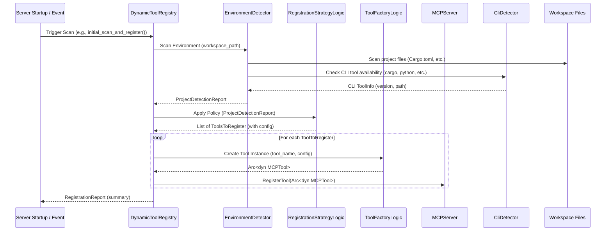

# 工具注册中心模块设计文档

## 模块概览

工具注册中心模块 (Dynamic Tool Registry) 是Grape MCP DevTools的核心服务组件。其主要职责是在服务器启动时或特定事件（如工作区变化）触发时，主动扫描当前开发环境（包括项目文件、已安装的CLI工具等），根据预设或动态评估的策略，决定加载哪些具体的 `MCPTool` 实现，并将这些工具实例注册到 `MCPServer` (或其内部的 `ToolManager`)，使其对AI客户端可见并可调用。

### 模块基本信息
- **模块路径**: `src/tools/dynamic_registry.rs`, `src/tools/environment_detector.rs`
- **主要作用**: 动态工具发现、环境检测、基于策略的工具注册、工具生命周期管理（实例化阶段）
- **核心特性**: 环境感知、策略驱动、按需加载、与 `MCPServer` 和 `CliDetector` 紧密集成。
- **支持语言**: 动态检测并为所有已实现相应 `MCPTool` 的语言（如Rust, Python, JavaScript/TypeScript, Java, Go, Dart/Flutter）注册工具。

## 架构设计

### 1. 模块结构

```
src/tools/
├── dynamic_registry.rs         # 动态注册核心逻辑 (DynamicToolRegistry)
├── environment_detector.rs     # 环境检测器 (EnvironmentDetector)
├── base.rs                     # MCPTool trait 定义
└── configs/registry_config.toml # (Conceptual) 模块配置文件

# 被注册的工具实例 (示例, 实际文件在 src/tools/specific_tools/ 或类似目录下)
# ├── rust_docs_tool.rs
# ├── python_docs_tool.rs
# ...
```

### 2. 核心组件架构

```mermaid
digraph CoreComponents {
    rankdir=LR;
    node [shape=box, style=rounded];

    MCPServer [label="MCPServer / ToolManager"];
    DynamicToolRegistry [label="DynamicToolRegistry"];
    EnvironmentDetector [label="EnvironmentDetector"];
    ToolFactory [label="ToolFactory (internal logic)"];
    RegistrationStrategy [label="RegistrationStrategy (enum & logic)"];
    CliDetector [label="CliDetector (from CLI Module)"];
    Workspace [label="Workspace Files (e.g., Cargo.toml)"];
    SystemPath [label="System PATH (CLI tools)"];

    DynamicToolRegistry -> MCPServer [label="registers tool instances"];
    DynamicToolRegistry -> EnvironmentDetector [label="requests env scan"];
    DynamicToolRegistry -> ToolFactory [label="requests tool creation"];
    DynamicToolRegistry -> RegistrationStrategy [label="applies strategy"];
    EnvironmentDetector -> Workspace [label="scans"];
    EnvironmentDetector -> SystemPath [label="checks via CliDetector"];
    EnvironmentDetector -> CliDetector [label="uses"];
    ToolFactory -> MCPServer [label="(indirectly) tools need config/context"]; 
}
```

### 3. 主要组件说明

#### 3.1 DynamicToolRegistry (`dynamic_registry.rs`)
**功能**: 动态工具注册的核心协调和管理器。
- 接收来自 `MCPServer` 的启动信号或特定事件（如工作区变更）。
- 调用 `EnvironmentDetector` 扫描当前环境。
- 应用 `RegistrationStrategy` 决定哪些工具应该被激活。
- 通过内部的 `ToolFactory` 逻辑创建选定工具的实例。
- 将创建的工具实例注册到 `MCPServer` (通过调用 `MCPServer::register_tool()` 或类似接口)。
- 管理注册报告和统计信息。

**关键接口/逻辑**:
```rust
// pub struct DynamicToolRegistry {
//     mcp_server: Arc<MCPServer>, // Handle to MCPServer for tool registration
//     detector: EnvironmentDetector,
//     config: RegistryConfig, // Contains policies, tool-specific configs
//     registered_tool_names: Mutex<HashSet<String>>,
// }

// impl DynamicToolRegistry {
    // pub async fn new(mcp_server: Arc<MCPServer>, config: RegistryConfig) -> Self
    // pub async fn initial_scan_and_register(&self) -> Result<RegistrationReport>
    // pub async fn rescan_and_update_registrations(&self) -> Result<RegistrationReport> // For dynamic updates
    // pub async fn on_demand_register_for_language(&self, language: &str) -> Result<Option<String>> // If a tool is requested but not active
    // fn apply_registration_policy(&self, detection_report: &DetectionReport) -> Vec<ToolToRegisterConfig>
    // async fn create_and_register_tool(&self, tool_config: &ToolToRegisterConfig) -> Result<()>
// }
```

#### 3.2 EnvironmentDetector (`environment_detector.rs`)
**功能**: 智能环境检测和分析，收集关于当前开发环境的上下文信息。
- **项目文件扫描**: 使用 `walkdir` 或类似库递归扫描工作区目录。查找特定项目文件，如 `Cargo.toml`, `package.json`, `requirements.txt`, `pom.xml`, `build.gradle`, `go.mod`, `pubspec.yaml`，以及其他配置文件或源码文件扩展名。
- **CLI工具检测**: 调用 `CliDetector` (来自CLI集成模块) 检查关键开发CLI工具 (如 `rustc`, `python`, `node`, `java`, `mvn`, `go`, `flutter`, `dart`) 是否在系统 `PATH` 中可用及其版本。
- **语言/框架识别**: 基于上述信息，推断项目中使用的主要编程语言和框架。

**检测维度 (`LanguageDetectionInfo`, `ProjectDetectionReport`)**:
```rust
// types.rs (or environment_detector.rs)
// pub struct LanguageDetectionInfo {
//     pub language_name: String, // e.g., "Rust", "Python"
//     pub confidence_score: f32, // How sure the detection is
//     pub project_files_found: Vec<PathBuf>, // e.g., ["./Cargo.toml"]
//     pub relevant_cli_tools: Vec<CliToolInfo>, // e.g., [CliToolInfo {name: "cargo", available: true, ...}]
//     pub detected_frameworks: Vec<String>, // e.g., ["Actix", "Django"]
// }

// pub struct ProjectDetectionReport {
//     pub detected_languages: HashMap<String, LanguageDetectionInfo>,
//     pub workspace_root: PathBuf,
//     pub scan_duration: Duration,
//     pub total_files_scanned: usize,
// }
```

#### 3.3 RegistrationStrategy (内部逻辑/enum in `dynamic_registry.rs`)
**功能**: 定义不同的工具注册决策逻辑。
- **策略类型 (`RegistrationPolicy` enum)**:
    - `ProjectBased`: 只有当检测到特定语言的项目文件 (如 `Cargo.toml`存在 -> 注册Rust相关工具) 且相关CLI工具可用时才注册。
    - `ToolAvailability`: 只要特定语言的CLI工具可用 (如 `python`命令存在 -> 注册Python工具)，就注册。
    - `ExplicitEnable`: 只注册在配置文件中明确启用的工具/语言。
    - `Adaptive`: (默认/推荐) 综合多种因素：项目文件数量/类型、特定依赖项声明 (e.g., `tokio` in `Cargo.toml`)、CLI工具版本、用户配置偏好。通过一个加权评分模型计算每种可能工具的激活分数，超过阈值则注册。
    - `Aggressive`: 尝试注册所有已知的、其基本依赖（如CLI）满足的工具。
    - `Conservative`: 仅在非常高置信度（如项目文件明确，CLI版本兼容）的情况下注册。
- **策略评分算法 (for `Adaptive` policy)**:
    - 伪代码:
      ```
      function calculate_activation_score(language_info):
          score = 0
          if language_info.project_files_found > N:
              score += WEIGHT_PROJECT_FILES * count(project_files)
          if language_info.relevant_cli_tools.any(tool -> tool.available):
              score += WEIGHT_CLI_TOOLS * version_factor(cli_tools)
          if language_info.has_specific_dependencies(e.g., "serde"):
              score += WEIGHT_SPECIFIC_DEPS
          // ... other factors
          return score
      ```
    - 权重和阈值应可在配置文件中调整。

#### 3.4 ToolFactory (内部逻辑 in `dynamic_registry.rs`)
**功能**: 根据检测到的语言和最终确定的注册决策，实际创建（实例化）`MCPTool` 的具体实现。
- **逻辑**: `DynamicToolRegistry` 在确定要注册一个例如 "Rust文档工具" 后，会调用类似 `RustDocsTool::new(config)` 的构造函数。 `config` 可能包含从主配置或环境检测中提取的该工具特定的设置 (如 `rustup`路径、默认文档源等)。
- 某些工具可能需要异步初始化 (e.g., 检查API密钥、加载缓存)，工厂逻辑需要处理这个。

### 4. 工具生命周期管理 (由 `DynamicToolRegistry` 协调)

**注册流程图**:


### 5. 环境检测算法 (在 `EnvironmentDetector` 中实现)

#### 5.1 文件类型/项目识别
- **扩展名**: 主要依据 (e.g., `.rs` -> Rust, `.py` -> Python)。
- **特定文件名**: `Cargo.toml`, `setup.py`, `package.json`, `pom.xml`, `build.gradle`, `go.mod`, `pubspec.yaml` 等是强指示信号。
- **Shebangs**: 分析脚本文件的第一行 (e.g., `#!/usr/bin/env python3`)。
- **目录结构**: 某些框架有特征性的目录结构 (e.g., `src/main/java` for Java/Maven)。
- **内容分析 (浅层)**: (可选) 检查文件中是否包含特定语言的常见关键字或导入语句，但需注意性能开销。

#### 5.2 CLI工具检测
- 委托给 `src/cli/detector.rs` 中的 `CliDetector`。
- `CliDetector` 通常执行 `tool_name --version` 或 `tool_name help` 来确认工具存在并获取版本信息。

### 6. 注册报告系统 (`RegistrationReport`)

#### 6.1 报告数据结构
```rust
// types.rs (or dynamic_registry.rs)
// #[derive(Debug, Clone, Serialize, Deserialize)]
// pub struct RegistrationReport {
//     pub registered_tools: Vec<String>, // Names of successfully registered tools
//     pub failed_registrations: Vec<(String, String)>, // (ToolName, ReasonForFailure)
//     pub suggested_installations: Vec<String>, // CLI tools that were missing but needed for certain tools
//     pub detection_summary: ProjectDetectionReport, // The environment scan results
//     pub applied_policy: String, // Name of the policy used
//     pub registration_duration_ms: u128,
// }

// impl RegistrationReport {
//     pub fn generate_summary_string(&self) -> String { /* ... */ }
// }
```

#### 6.2 统计和监控
- `DynamicToolRegistry` 可以内部维护计数器，并通过特定接口或Prometheus指标（如果集成）暴露：
    - 总扫描次数、平均扫描时间。
    - 各语言/工具的注册成功/失败次数。
    - 当前激活的工具数量。

### 7. 智能工具安装 (与 `src/cli/tool_installer.rs` 交互)

#### 7.1 自动安装配置
- 在主配置文件中定义是否允许自动安装缺失的CLI工具。
    ```toml
    # configs/application_config.toml
    [cli_integration]
    auto_install_missing_tools = true # or false
    default_install_timeout_seconds = 300
    ```
- `DynamicToolRegistry` 在初始化时读取此配置，并在需要时配置和调用 `ToolInstaller`。

#### 7.2 工具安装流程
- 当 `EnvironmentDetector` 发现某个期望的CLI工具（如 `rustc`）缺失，但注册策略又指示需要基于此CLI的MCP工具时：
    1. `DynamicToolRegistry` 检查 `auto_install_missing_tools` 配置。
    2. 如果为 `true`，则调用 `ToolInstaller::install_tool("rustc", Some(language_context))`。
    3. 如果安装成功，`EnvironmentDetector` 可能会被要求重新检测该特定CLI，然后注册流程继续。
    4. 如果安装失败或被禁用，则该MCP工具可能无法注册，记录在`RegistrationReport`的`failed_registrations`或`suggested_installations`中。

### 8. 按需注册与热重载

#### 8.1 按需注册 (On-Demand Registration)
- **场景**: 客户端请求一个当前未激活的工具，或进入了一个新的项目子目录，可能需要特定工具。
- **触发**: `MCPServer` 在 `tools/call` 发现工具未注册时，可以通知 `DynamicToolRegistry`。
- **逻辑 (`on_demand_register_for_language`)**: `DynamicToolRegistry` 针对特定语言或工具类型，快速执行一次轻量级的环境检测（或使用最近的缓存结果），如果满足条件，则尝试创建并注册该工具。成功后通知 `MCPServer` 重试工具调用。

#### 8.2 热重载支持 (Periodic Rescan / Watcher-based)
- **触发**: 定时器 (`rescan_interval_seconds`) 或文件系统观察者 (monitoring `Cargo.toml` etc. for changes)。
- **逻辑 (`rescan_and_update_registrations`)**:
    1. 执行完整的环境重新扫描 (`EnvironmentDetector`)。
    2. 将新的 `ProjectDetectionReport` 与当前的激活工具列表进行比较。
    3. **新增工具**: 如果检测到新的符合条件的语言/框架，则创建并注册新工具。
    4. **移除工具**: 如果之前注册的工具的环境依赖不再满足 (e.g., `Cargo.toml`被删除)，则从 `MCPServer` 注销 (unregister) 该工具。
    5. `MCPServer` 可能需要通知客户端 `tools/listChanged` (如果支持此MCP扩展)。

### 9. 缓存和性能优化

#### 9.1 检测结果缓存
- `EnvironmentDetector` 的 `ProjectDetectionReport` 可以被缓存 (e.g., 内存中，带有时效性)。
- `CliDetector` 本身会缓存CLI工具的检测结果。
- 这可以加快重复扫描或按需注册的速度。

#### 9.2 并行处理优化
- `EnvironmentDetector` 在扫描文件系统时，可以使用 `rayon` 进行并行目录遍历或文件内容初步检查。
- 并行检测多个CLI工具 (由 `CliDetector` 处理)。
- `DynamicToolRegistry` 在创建多个工具实例时，如果工具的 `::new()` 方法是异步且独立的，可以并发执行它们。

### 10. 配置管理

#### 10.1 注册中心配置文件 (e.g., `configs/registry_config.toml` or part of main config)
```toml
[dynamic_registry]
# Default policy to apply if not overridden by specific rules
# Possible values: "Adaptive", "ProjectBased", "ToolAvailability", "ExplicitEnable", "Aggressive", "Conservative"
default_policy = "Adaptive"

# Interval for periodic rescans of the environment, in seconds. 0 to disable.
rescan_interval_seconds = 300 

# Whether to attempt to automatically install missing CLI tools that are dependencies for MCP tools.
auto_install_missing_cli = true

# Configuration for the Adaptive policy
[dynamic_registry.policies.adaptive]
min_project_files_for_detection = 2 # e.g., need at least 2 .rs files for Rust project
cli_tool_presence_weight = 0.4      # Weight for CLI tool availability in scoring
project_file_presence_weight = 0.6  # Weight for project file presence
activation_score_threshold = 0.5    # Score needed to activate a tool/language set

# Explicitly enable or disable registration for specific languages/tools, overriding policy detection.
[dynamic_registry.languages.rust]
enabled = true # true, false, or "auto" (uses policy)
# specific_tool_configs: e.g., path_to_rustfmt_config for a formatting tool

[dynamic_registry.languages.python]
enabled = "auto"
min_version_cli = "3.8" # EnvironmentDetector can check this via CliDetector

# Configuration for specific tools, if they need it during instantiation by ToolFactory
[tool_configs.RustDocsTool]
# custom_doc_path_template = "..."
```

#### 10.2 运行时配置
- `DynamicToolRegistry` 在创建时接收一个 `RegistryConfig` 结构体，该结构体从上述TOML文件加载而来。
- 允许通过环境变量覆盖部分配置项。

### 11. 错误处理和恢复

#### 11.1 错误类型 (`RegistryError` enum)
```rust
// #[derive(Debug, thiserror::Error)]
// pub enum RegistryError {
//     #[error("Environment detection failed: {0}")]
//     DetectionFailed(String),
//     
//     #[error("Tool instantiation failed for '{tool_name}': {reason}")]
//     ToolInstantiationFailed { tool_name: String, reason: String },
// 
//     #[error("Tool registration with MCPServer failed for '{tool_name}': {reason}")]
//     ToolRegistrationFailed { tool_name: String, reason: String },
// 
//     #[error("Invalid registration policy configuration: {0}")]
//     InvalidPolicyConfig(String),
// 
//     #[error("CLI tool installation failed for '{cli_tool_name}': {source_error}")]
//     InstallationFailed { cli_tool_name: String, source_error: String },
// 
//     #[error("Configuration error: {0}")]
//     ConfigError(String),
// }
```

#### 11.2 故障恢复/优雅降级
- **DetectionFailed**: 可以尝试使用上次成功的 `ProjectDetectionReport` (如果缓存了)，或者回退到只注册一组非常基础的、不依赖环境的工具。
- **ToolInstantiationFailed/ToolRegistrationFailed**: 记录错误，跳过该工具，继续注册其他工具。报告中应包含失败信息。
- **InstallationFailed**: 标记该CLI工具为不可用，依赖此CLI的MCP工具将无法注册。用户应被告知安装建议。
- **InvalidPolicyConfig/ConfigError**: 可能是致命错误，导致注册中心无法正常工作。应记录详细错误并可能阻止服务器完全启动，或以极度保守的策略运行。

### 12. 测试策略

#### 12.1 单元测试
- **`EnvironmentDetector`**: 
    - Mock文件系统 (e.g., using `tempfile` to create dummy project structures) 和 `CliDetector`。
    - 测试对不同项目类型 (Rust, Python, etc.) 的识别准确性。
    - 测试对混合语言项目的处理。
- **`RegistrationStrategyLogic`**: 
    - 给定各种模拟的 `ProjectDetectionReport`，测试不同策略下的决策是否符合预期。
    - 测试评分算法的边界条件。
- **`DynamicToolRegistry` (core logic)**:
    - Mock `EnvironmentDetector`, `ToolFactory` (or its logic), and `MCPServer`.
    - 测试注册流程的协调，工具的添加/移除逻辑。
    - 测试错误处理：当依赖组件返回错误时，注册中心如何响应。

#### 12.2 集成测试
- **Setup**: 准备包含不同语言项目（真实或模拟的 `Cargo.toml`, `package.json`等）的测试工作区。确保CI环境中有或可以mock关键的CLI工具 (`rustc`, `node`, `python`)。
- **Test**: 
    - 启动一个嵌入式的 `MCPServer` 和 `DynamicToolRegistry`。
    - 执行 `initial_scan_and_register()`。
    - 验证 `MCPServer` 中是否注册了预期的工具 (通过调用 `MCPServer::list_tools()` 或类似方法)。
    - 验证 `RegistrationReport` 的内容是否准确。
    - 模拟工作区变化 (e.g., 添加/删除一个 `Cargo.toml`)，触发 `rescan_and_update_registrations()`，并验证工具列表是否相应更新。
    - 测试自动安装流程 (如果 `ToolInstaller` 被集成和启用)。

## 使用示例

### 基本初始化与扫描
```rust
// main.rs or server_setup.rs
// async fn setup_and_run_server() -> Result<(), Box<dyn Error>> {
//     // 1. Load application configuration (including registry_config_path)
//     let app_config = load_app_config()?;
// 
//     // 2. Create MCPServer instance
//     let mcp_server = Arc::new(MCPServer::new(app_config.mcp_server_config()));
// 
//     // 3. Create DynamicToolRegistry instance
//     let tool_registry_config = load_registry_config(&app_config.registry_config_path)?;
//     let dynamic_registry = DynamicToolRegistry::new(Arc::clone(&mcp_server), tool_registry_config);
// 
//     // 4. Perform initial environment scan and tool registration
//     match dynamic_registry.initial_scan_and_register().await {
//         Ok(report) => {
//             info!("Dynamic tool registration complete: {}", report.generate_summary_string());
//             if !report.suggested_installations.is_empty() {
//                 warn!("Suggested CLI installations: {:?}", report.suggested_installations);
//             }
//         }
//         Err(e) => {
//             error!("Dynamic tool registration failed: {}", e);
//             // Decide if this is a fatal error
//         }
//     }
// 
//     // 5. Start MCPServer's main loop (listening for client connections)
//     mcp_server.run().await;
// 
//     Ok(())
// }
```

## 总结

工具注册中心模块 (`DynamicToolRegistry` 及其助手 `EnvironmentDetector`) 扮演着 `grape-mcp-devtools` 的"智能感知与配置核心"。它通过深入分析本地开发环境，并结合灵活的注册策略，确保MCP服务器能够动态地、恰当地为AI编程助手提供最相关的工具集。这种设计不仅提升了工具的上下文适应性，也为未来扩展新语言支持和更复杂的工具激活逻辑奠定了坚实基础。其健壮的错误处理和可配置性是确保在多样化用户环境中稳定运行的关键。 