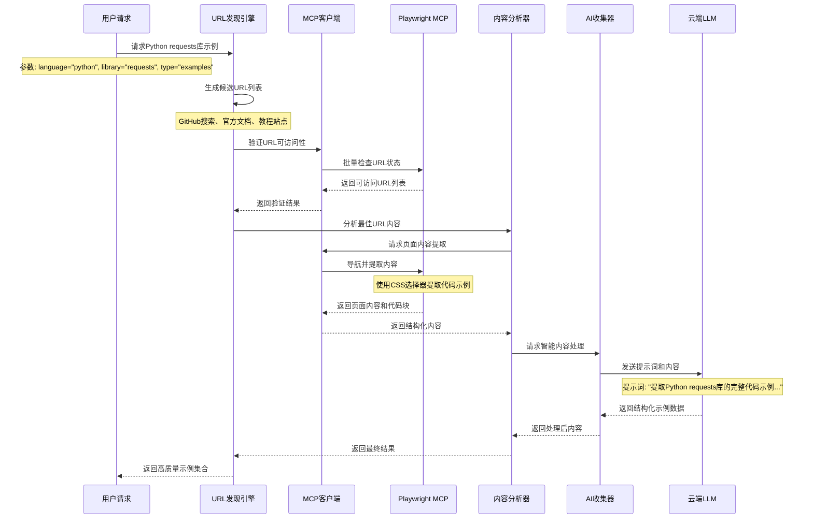

# 语言特性模块设计文档

## 模块概览

语言特性模块 (Language Features Module) 是 `grape-mcp-devtools` 中的一个共享服务层，旨在为其他模块（特别是文档处理模块、未来可能的代码分析/生成工具、智能重构工具等）提供超越简单文本处理的高级内容处理、智能分析和AI驱动的数据收集与生成能力。其目标是赋予 `grape-mcp-devtools` 更深层次的语义理解和上下文感知能力，从而提供更智能、更精准的辅助功能。

### 模块基本信息
- **模块路径**: `src/language_features/` (主要包括 `ai_collector.rs`, `scraper.rs`, `url_discoverer.rs`, `doc_crawler.rs`, `content_analyzer.rs`, `pipeline.rs` 等)
- **主要作用**: 智能网页爬取、动态内容处理、高级文本分析（如代码块识别、API签名提取、NER）、与大型语言模型 (LLM) 交互以进行内容摘要/生成/解释、URL模式分析和发现。
- **核心特性**: LLM集成、高级爬虫技术、多维度内容分析、可配置的AI能力、可扩展的分析组件。
- **服务对象**: `DocProcessor`, `SearchService`, 未来可能的代码智能工具等。

## 架构设计

### 1. 模块在系统中的位置

语言特性模块作为后台服务，被工具层（如 `DocProcessor`）按需调用，以增强其内容获取和理解能力。它不直接暴露给MCP客户端。

```mermaid
graph LR
    A[DocProcessor] --> B(LanguageFeatures Module);
    C[SearchService] --> B;
    D[FutureCodeAnalysisTool] --> B;

    subgraph LanguageFeatures Module
        direction LR
        LF1[AICollector] <--> LF2[ContentAnalyzer];
        LF2 <--> LF3[URLDiscoveryEngine];
        LF3 --> LF4[MCP工具代理];
        LF4 --> LF5[外部MCP工具];
        LF1 <--> ExternalLLMs[External LLM APIs (OpenAI, Anthropic)];
        LF2 <--> LocalNLPModels[Small Local NLP Models (rust-bert for NER, whatlang)];
        LF3 <--> SmartURLAnalyzer;
    end

    subgraph External_MCP_Tools [外部MCP工具]
        Playwright[Playwright MCP服务器]
        Git[Git MCP服务器]
        FileSystem[文件系统MCP服务器]
    end

    LF5 <--> External_MCP_Tools
```

### 2. 内部组件架构图

```mermaid
digraph LanguageFeaturesInternal {
    rankdir=TB;
    node [shape=box, style=rounded];

    subgraph UserFacingComponents [label="调用方 (e.g., DocProcessor)"]
        DocProc [label="DocProcessor"];
    end

    subgraph LanguageFeaturesCore [label="Language Features Module (`src/language_features/`)"]
        AICollector [label="AICollector\n(ai_collector.rs)\n- LLM Interaction (OpenAI, Anthropic)"];
        ContentAnalyzer [label="ContentAnalyzer\n(content_analyzer.rs)\n- Text analysis, code block/API extraction, NER"];
        URLDiscoveryEngine [label="URLDiscoveryEngine\n(url_discoverer.rs)\n- Finds related URLs"];
        SmartURLAnalyzer [label="SmartURLAnalyzer\n(smart_url_analyzer.rs)\n- URL pattern/type analysis"];
    end

    subgraph ExternalDependencies [label="External Libraries & Services"]
        HttpClient [label="HTTP Client (reqwest)"];
        HTMLParser [label="HTML Parser (scraper)"];
        NLPLocal [label="Local NLP (rust-bert, whatlang, natural, guesslang)"];
        LLMRemote [label="Remote LLM APIs (async-openai, etc.)"];
        HFHub [label="Hugging Face Hub (hf-hub for local models)"];
        HeadlessBrowser [label="Headless Browser (optional, e.g., headless_chrome)"];
    end

    DocProc --> AICollector;
    AICollector --> ContentAnalyzer;
    ContentAnalyzer --> URLDiscoveryEngine;
    URLDiscoveryEngine --> SmartURLAnalyzer;
    SmartURLAnalyzer --> URLDiscoveryEngine; 
}
```

### 3. 主要组件说明

#### 3.1 `AICollector` (`ai_collector.rs`)

**职责**: 利用云端LLM API进行智能内容收集、分析和生成。

**核心功能**:
- **提示词驱动的内容提取**: 根据特定提示词从文本中提取目标信息（如版本号、安装命令、API签名）
- **内容摘要和结构化**: 将长文本（如changelog、README）转换为结构化摘要
- **多语言内容生成**: 基于现有内容生成文档、示例或解释
- **语义理解**: 理解文档内容的语义，辅助URL发现和内容分析

**关键接口**:
```rust
pub struct AICollector {
    llm_client: Arc<dyn LLMClient + Send + Sync>,
    prompt_templates: PromptTemplateManager,
    config: AICollectorConfig,
}

impl AICollector {
    pub async fn extract_with_prompt(&self, content: &str, extraction_prompt: &str) -> Result<ExtractedInfo, AIError>;
    pub async fn summarize_changelog(&self, changelog_content: &str, target_version: Option<&str>) -> Result<ChangelogSummary, AIError>;
    pub async fn generate_examples(&self, api_docs: &str, context: &GenerationContext) -> Result<Vec<CodeExample>, AIError>;
    pub async fn analyze_content_type(&self, content: &str) -> Result<ContentTypeAnalysis, AIError>;
}

// 提示词驱动的信息提取示例
pub struct ExtractionPrompt {
    pub target_content_type: ContentType, // Examples, Changelog, API_Docs, etc.
    pub extraction_rules: Vec<String>,
    pub output_format: OutputFormat,
}

pub struct ExtractedInfo {
    pub structured_data: serde_json::Value,
    pub confidence_score: f32,
    pub source_references: Vec<SourceReference>,
}
```

**提示词模板示例**:
```rust
impl PromptTemplateManager {
    pub fn get_changelog_extraction_prompt(&self, library_name: &str) -> String {
        format!(
            "从以下{}库的changelog中提取关键信息：
            1. 最新版本号和发布日期
            2. 重要的新功能和改进
            3. 破坏性变更（Breaking Changes）
            4. 安全修复
            
            请以JSON格式返回，包含version、date、features、breaking_changes、security_fixes字段。
            
            Changelog内容：
            {{content}}",
            library_name
        )
    }
    
    pub fn get_example_extraction_prompt(&self, language: &str) -> String {
        format!(
            "从以下{}代码文档中提取完整的代码示例：
            1. 提取所有可运行的代码块
            2. 为每个示例添加简短描述
            3. 标注示例的复杂度级别（初级/中级/高级）
            4. 提取相关的依赖和导入语句
            
            返回格式：JSON数组，每个元素包含code、description、level、dependencies字段。
            
            文档内容：
            {{content}}",
            language
        )
    }
}
```

#### 3.2 `URLDiscoveryEngine` (`url_discovery.rs`)

**职责**: 智能发现与特定编程语言、库或主题相关的URL资源。

**核心功能**:
- **基于上下文的URL生成**: 根据`DiscoveryContext`中的语言、库名、内容类型生成候选URL
- **URL有效性验证**: 使用`SmartURLAnalyzer`评估URL的相关性和可访问性
- **多源URL发现**: 支持官方文档、GitHub、包管理器等多种URL源
- **动态URL模式学习**: 基于成功的URL模式改进发现算法

**关键接口**:
```rust
pub struct URLDiscoveryEngine {
    mcp_client: Arc<MCPClientManager>, // 用于调用外部MCP工具
    url_patterns: URLPatternDatabase,
    smart_analyzer: SmartURLAnalyzer,
    config: DiscoveryConfig,
}

impl URLDiscoveryEngine {
    pub async fn discover_urls(&self, context: &DiscoveryContext) -> Result<Vec<DiscoveredURL>, DiscoveryError>;
    pub async fn validate_urls(&self, urls: &[String]) -> Vec<URLValidationResult>;
    pub async fn find_documentation_urls(&self, library_name: &str, language: &str, content_type: ContentType) -> Result<Vec<String>, DiscoveryError>;
}

pub struct DiscoveryContext {
    pub language: String,
    pub library_name: String,
    pub target_content_type: ContentType, // Examples, Changelog, API_Docs, README
    pub version_constraint: Option<String>,
    pub additional_keywords: Vec<String>,
}

pub enum ContentType {
    Examples,
    Changelog,
    ApiDocs,
    Readme,
    Installation,
    Tutorial,
}

pub struct DiscoveredURL {
    pub url: String,
    pub relevance_score: f32,
    pub content_type: ContentType,
    pub source: URLSource, // Official, GitHub, PackageManager, Community
}
```

**URL发现策略示例**:
```rust
impl URLDiscoveryEngine {
    async fn generate_candidate_urls(&self, context: &DiscoveryContext) -> Vec<String> {
        let mut urls = Vec::new();
        
        match context.target_content_type {
            ContentType::Examples => {
                // GitHub示例搜索
                urls.push(format!("https://github.com/search?q={} {} examples language:{}", 
                    context.library_name, context.language, context.language));
                
                // 官方文档示例页面
                if let Some(official_base) = self.get_official_docs_base(&context.language, &context.library_name) {
                    urls.push(format!("{}/examples", official_base));
                    urls.push(format!("{}/tutorial", official_base));
                }
            },
            ContentType::Changelog => {
                // GitHub releases页面
                if let Some(repo_url) = self.find_github_repo(&context.library_name, &context.language).await {
                    urls.push(format!("{}/releases", repo_url));
                    urls.push(format!("{}/blob/main/CHANGELOG.md", repo_url));
                }
                
                // 包管理器changelog
                urls.extend(self.get_package_manager_changelog_urls(context));
            },
            ContentType::ApiDocs => {
                // 官方API文档
                urls.extend(self.get_official_api_docs_urls(context));
                
                // 第三方文档站点
                urls.extend(self.get_third_party_docs_urls(context));
            },
            _ => {}
        }
        
        urls
    }
}
```

#### 3.3 `ContentAnalyzer` (`content_analyzer.rs`)

**职责**: 分析和处理从各种源获取的内容，提取有价值的信息。

**核心功能**:
- **内容类型识别**: 自动识别内容是API文档、示例代码、changelog等
- **结构化内容提取**: 从HTML、Markdown、纯文本中提取结构化信息
- **代码块识别和分类**: 识别并分类代码示例、API签名、配置文件等
- **多语言内容处理**: 支持多种编程语言的语法高亮和结构分析

**关键接口**:
```rust
pub struct ContentAnalyzer {
    mcp_client: Arc<MCPClientManager>, // 用于调用外部工具获取内容
    nlp_models: LocalNLPModels,
    analysis_config: AnalysisConfig,
}

impl ContentAnalyzer {
    pub async fn analyze_web_content(&self, url: &str, analysis_config: &AnalysisConfig) -> Result<AnalyzedContent, AnalysisError>;
    pub async fn extract_code_examples(&self, content: &str, language: &str) -> Result<Vec<CodeExample>, AnalysisError>;
    pub async fn parse_changelog(&self, content: &str) -> Result<ParsedChangelog, AnalysisError>;
    pub async fn identify_content_structure(&self, content: &str) -> Result<ContentStructure, AnalysisError>;
}

pub struct AnalysisConfig {
    pub target_content_type: ContentType,
    pub extraction_selectors: Vec<String>, // CSS选择器用于Playwright
    pub language_context: Option<String>,
    pub depth_limit: usize,
}

pub struct AnalyzedContent {
    pub content_type: ContentType,
    pub structured_data: ContentStructure,
    pub extracted_code: Vec<CodeExample>,
    pub metadata: ContentMetadata,
    pub quality_score: f32,
}
```

**内容分析流程**:
```rust
impl ContentAnalyzer {
    pub async fn analyze_web_content(&self, url: &str, config: &AnalysisConfig) -> Result<AnalyzedContent, AnalysisError> {
        // 1. 使用Playwright MCP获取页面内容
        let page_content = self.fetch_page_content(url, config).await?;
        
        // 2. 根据内容类型应用特定的分析逻辑
        let structured_data = match config.target_content_type {
            ContentType::Examples => self.extract_examples_structure(&page_content).await?,
            ContentType::Changelog => self.extract_changelog_structure(&page_content).await?,
            ContentType::ApiDocs => self.extract_api_structure(&page_content).await?,
            _ => self.extract_generic_structure(&page_content).await?,
        };
        
        // 3. 提取代码块
        let extracted_code = self.extract_code_examples(&page_content.text, 
            config.language_context.as_deref().unwrap_or("")).await?;
        
        // 4. 生成内容质量评分
        let quality_score = self.calculate_quality_score(&structured_data, &extracted_code);
        
        Ok(AnalyzedContent {
            content_type: config.target_content_type.clone(),
            structured_data,
            extracted_code,
            metadata: page_content.metadata,
            quality_score,
        })
    }
    
    async fn fetch_page_content(&self, url: &str, config: &AnalysisConfig) -> Result<PageContent, AnalysisError> {
        // 调用Playwright MCP服务器获取页面内容
        let params = json!({
            "url": url,
            "wait_for": "networkidle",
            "selectors": config.extraction_selectors,
            "extract_text": true,
            "extract_html": true
        });
        
        let result = self.mcp_client.call_tool("playwright_extract_content", params).await
            .map_err(|e| AnalysisError::ContentFetchFailed(e.to_string()))?;
        
        // 转换MCP结果为内部格式
        PageContent::from_mcp_result(result)
    }
}
```

#### 3.4 移除的组件

以下组件将被移除或重构，因为它们的功能现在由外部MCP工具提供：

- ~~`IntelligentScraper`~~: 网页爬虫功能由Playwright MCP服务器提供
- ~~`DocCrawler`~~: 文档爬取功能由Playwright和Git MCP服务器提供
- ~~`enhanced_content_pipeline.rs`~~: 内容处理流水线简化，直接使用MCP工具

### 4. AI集成

#### 4.1 云端LLM集成

**支持的LLM服务**:
- **OpenAI API**: GPT-4, GPT-3.5-turbo用于内容生成和分析
- **Anthropic API**: Claude用于复杂文档理解和摘要
- **其他兼容OpenAI API的服务**: 如Azure OpenAI, 本地部署的兼容服务

**LLM客户端抽象**:
```rust
#[async_trait]
pub trait LLMClient {
    async fn generate_completion(&self, prompt: &str, config: &CompletionConfig) -> Result<String, LLMError>;
    async fn generate_structured(&self, prompt: &str, schema: &serde_json::Value) -> Result<serde_json::Value, LLMError>;
    async fn generate_embeddings(&self, texts: &[String]) -> Result<Vec<Vec<f32>>, LLMError>;
}

pub struct OpenAIClient {
    client: async_openai::Client<async_openai::config::OpenAIConfig>,
    default_model: String,
}

pub struct AnthropicClient {
    client: anthropic_sdk::Client,
    default_model: String,
}
```

#### 4.2 本地小型NLP模型

**支持的本地模型**:
- **rust-bert**: 用于命名实体识别(NER)、文本分类
- **whatlang**: 语言检测
- **tokenizers**: 文本分词和预处理

**本地模型用途**:
```rust
pub struct LocalNLPModels {
    ner_model: Option<NERModel>,
    language_detector: whatlang::Detector,
    tokenizer: Option<tokenizers::Tokenizer>,
}

impl LocalNLPModels {
    pub fn detect_language(&self, text: &str) -> Option<whatlang::Lang> {
        self.language_detector.detect(text)
    }
    
    pub async fn extract_entities(&self, text: &str) -> Result<Vec<Entity>, NLPError> {
        if let Some(ref model) = self.ner_model {
            model.predict(text).await
        } else {
            Ok(Vec::new())
        }
    }
    
    pub fn classify_code_block(&self, code: &str) -> CodeBlockType {
        // 基于简单规则和模式匹配的代码块分类
        if code.contains("import ") || code.contains("from ") {
            CodeBlockType::Import
        } else if code.contains("def ") || code.contains("function ") {
            CodeBlockType::Function
        } else if code.contains("class ") {
            CodeBlockType::Class
        } else {
            CodeBlockType::Example
        }
    }
}
```

### 5. 配置与可扩展性

#### 5.1 配置管理

**语言特性配置示例**:
```json
{
  "ai_collector": {
    "llm_provider": "openai",
    "default_model": "gpt-4",
    "max_tokens": 4000,
    "temperature": 0.1,
    "prompt_templates": {
      "changelog_extraction": "templates/changelog_extraction.txt",
      "example_extraction": "templates/example_extraction.txt"
    }
  },
  "url_discovery": {
    "max_urls_per_search": 10,
    "timeout_seconds": 30,
    "official_docs_patterns": {
      "python": ["https://docs.python.org/", "https://pypi.org/project/{}/"],
      "rust": ["https://docs.rs/{}/", "https://crates.io/crates/{}"],
      "javascript": ["https://www.npmjs.com/package/{}", "https://developer.mozilla.org/"]
    }
  },
  "content_analyzer": {
    "enable_local_nlp": true,
    "max_content_size": "10MB",
    "supported_languages": ["python", "rust", "javascript", "typescript", "java", "go"]
  },
  "mcp_integration": {
    "playwright_server": "playwright",
    "git_server": "git",
    "filesystem_server": "filesystem",
    "timeout_seconds": 60
  }
}
```

#### 5.2 核心流程示例

**基于提示词的目标性文档获取流程**:



## 🚀 基于MCP的多Agent爬虫系统

### 5. 多Agent智能爬虫架构

当传统CLI工具无法提供满意的文档时，语言特性模块提供基于MCP客户端的多agent爬虫系统，专注于准确的内容提取和融合。

#### 5.1 核心Agent架构（基于LLM驱动）
```rust
pub struct MultiAgentCrawlerSystem {
    // 核心协调器
    task_coordinator: Arc<TaskCoordinator>,
    
    // LLM驱动的专用Agent
    url_discovery_agent: Arc<URLDiscoveryAgent>,
    content_extraction_agent: Arc<ContentExtractionAgent>,
    page_navigation_agent: Arc<PageNavigationAgent>,
    content_fusion_agent: Arc<ContentFusionAgent>,
    
    // MCP客户端管理
    mcp_client_manager: Arc<MCPClientManager>,
    
    // LLM服务集成 - 核心组件
    llm_orchestrator: Arc<LLMOrchestrator>,
    prompt_manager: Arc<PromptManager>,
    
    // 配置
    crawler_config: CrawlerConfig,
}

impl MultiAgentCrawlerSystem {
    pub async fn crawl_documentation(&self, request: DocumentationRequest) -> CrawledDocumentation {
        // 第一阶段：LLM驱动的任务分析和URL发现
        let task_analysis = self.task_coordinator.analyze_task_with_llm(&request).await?;
        let discovered_urls = self.url_discovery_agent.discover_urls_with_llm(&task_analysis).await?;
        
        // 第二阶段：LLM引导的多页面并行爬取
        let crawl_results = self.content_extraction_agent.crawl_with_llm_guidance(discovered_urls).await?;
        
        // 第三阶段：LLM驱动的内容融合
        let fused_content = self.content_fusion_agent.fuse_content_with_llm(crawl_results).await?;
        
        CrawledDocumentation {
            content: fused_content,
            sources: crawl_results.iter().map(|r| r.source_url.clone()).collect(),
            crawl_metadata: self.create_crawl_metadata(),
        }
    }
}
```

#### 5.2 LLM驱动的任务协调Agent
```rust
pub struct TaskCoordinator {
    mcp_client: Arc<MCPClientManager>,
    llm_orchestrator: Arc<LLMOrchestrator>,
    prompt_manager: Arc<PromptManager>,
}

impl TaskCoordinator {
    pub async fn analyze_task_with_llm(&self, request: &DocumentationRequest) -> TaskAnalysis {
        // 使用LLM深度理解用户意图
        let intent_analysis = self.analyze_user_intent_with_llm(request).await?;
        
        // LLM协助识别目标技术栈和相关概念
        let tech_context = self.extract_technical_context_with_llm(request).await?;
        
        // LLM确定最佳爬取策略
        let crawl_strategy = self.determine_crawl_strategy_with_llm(&intent_analysis, &tech_context).await?;
        
        TaskAnalysis {
            user_intent: intent_analysis,
            technical_context: tech_context,
            content_type: crawl_strategy.content_type,
            target_sites: crawl_strategy.target_sites,
            crawl_depth: crawl_strategy.depth,
            priority_patterns: crawl_strategy.patterns,
        }
    }
    
    async fn analyze_user_intent_with_llm(&self, request: &DocumentationRequest) -> UserIntent {
        let prompt = self.prompt_manager.create_intent_analysis_prompt(request);
        
        let llm_response = self.llm_orchestrator.generate_structured_response(
            &prompt,
            &json_schema_for_user_intent()
        ).await?;
        
        UserIntent::from_llm_response(llm_response)
    }
    
    async fn extract_technical_context_with_llm(&self, request: &DocumentationRequest) -> TechnicalContext {
        let prompt = format!(
            "分析以下技术查询的上下文信息：
            语言: {}
            目标: {}
            查询: {}
            
            请识别：
            1. 主要技术栈和框架
            2. 相关的生态系统组件
            3. 可能的用例场景
            4. 技术复杂度级别
            5. 推荐的文档来源类型
            
            以JSON格式返回结构化信息。",
            request.language, request.target, request.query
        );
        
        let llm_response = self.llm_orchestrator.generate_structured_response(
            &prompt,
            &json_schema_for_technical_context()
        ).await?;
        
        TechnicalContext::from_llm_response(llm_response)
    }
}
```

#### 5.3 LLM增强的URL发现Agent
```rust
pub struct URLDiscoveryAgent {
    mcp_client: Arc<MCPClientManager>,
    llm_orchestrator: Arc<LLMOrchestrator>,
    url_patterns: URLPatternDatabase,
}

impl URLDiscoveryAgent {
    pub async fn discover_urls_with_llm(&self, task: &TaskAnalysis) -> Vec<DiscoveredURL> {
        // 第一步：基于模式生成候选URL
        let pattern_based_urls = self.generate_pattern_based_urls(task).await;
        
        // 第二步：LLM生成创新的URL发现策略
        let llm_generated_urls = self.generate_urls_with_llm_creativity(task).await?;
        
        // 第三步：合并并通过LLM评估相关性
        let all_candidates = [pattern_based_urls, llm_generated_urls].concat();
        let llm_scored_urls = self.score_urls_with_llm(all_candidates, task).await?;
        
        // 第四步：Playwright验证可访问性
        let validated_urls = self.validate_urls_with_playwright(llm_scored_urls).await?;
        
        validated_urls
    }
    
    async fn generate_urls_with_llm_creativity(&self, task: &TaskAnalysis) -> Result<Vec<String>, CrawlerError> {
        let prompt = format!(
            "基于以下任务分析，创造性地生成可能包含相关文档的URL：
            
            技术上下文: {:?}
            内容类型: {:?}
            目标技术: {}
            
            请考虑：
            1. 官方文档站点的变体URL
            2. 社区维护的文档资源
            3. GitHub仓库中的特定文档文件
            4. 第三方教程和博客站点
            5. 技术论坛和问答社区
            
            返回JSON数组，每个URL包含url和reasoning字段。",
            task.technical_context,
            task.content_type,
            task.technical_context.primary_technology
        );
        
        let llm_response = self.llm_orchestrator.generate_structured_response(
            &prompt,
            &json_schema_for_url_suggestions()
        ).await?;
        
        Ok(extract_urls_from_llm_response(llm_response))
    }
    
    async fn score_urls_with_llm(&self, urls: Vec<String>, task: &TaskAnalysis) -> Result<Vec<ScoredURL>, CrawlerError> {
        let prompt = format!(
            "评估以下URL列表对于特定文档需求的相关性：
            
            任务需求: {:?}
            URL列表: {:?}
            
            为每个URL评分（0-1）并说明理由。考虑：
            1. URL结构与需求的匹配度
            2. 网站的权威性和可靠性
            3. 可能包含目标内容的概率
            4. 内容的时效性和准确性
            
            返回JSON数组，每个元素包含url、score、reasoning字段。",
            task.user_intent,
            urls
        );
        
        let llm_response = self.llm_orchestrator.generate_structured_response(
            &prompt,
            &json_schema_for_url_scoring()
        ).await?;
        
        Ok(ScoredURL::from_llm_response(llm_response))
    }
}
```

#### 5.4 LLM增强的内容提取Agent
```rust
pub struct ContentExtractionAgent {
    mcp_client: Arc<MCPClientManager>,
    llm_orchestrator: Arc<LLMOrchestrator>,
    extraction_config: ExtractionConfig,
}

impl ContentExtractionAgent {
    pub async fn crawl_with_llm_guidance(&self, urls: Vec<DiscoveredURL>) -> Vec<CrawlResult> {
        let mut crawl_tasks = Vec::new();
        
        for url in urls {
            let task = self.crawl_single_page_with_llm(url);
            crawl_tasks.push(task);
        }
        
        let results = futures::try_join_all(crawl_tasks).await?;
        results.into_iter().flatten().collect()
    }
    
    async fn crawl_single_page_with_llm(&self, url: DiscoveredURL) -> Option<CrawlResult> {
        // 第一步：LLM分析页面结构和内容类型
        let page_analysis = self.analyze_page_with_llm(&url).await?;
        
        // 第二步：基于LLM分析调整提取策略
        let extraction_strategy = self.adapt_extraction_strategy_with_llm(&page_analysis).await?;
        
        // 第三步：使用Playwright执行提取
        let page_content = self.extract_with_playwright(&url, &extraction_strategy).await?;
        
        // 第四步：LLM后处理和结构化内容
        let structured_content = self.structure_content_with_llm(&page_content, &url.content_type).await?;
        
        // 第五步：LLM指导的子页面发现
        let sub_pages = self.discover_sub_pages_with_llm(&structured_content, &url).await;
        
        let mut all_content = vec![structured_content];
        for sub_url in sub_pages {
            if let Some(sub_content) = self.extract_sub_page_with_llm(&sub_url).await {
                all_content.push(sub_content);
            }
        }
        
        Some(CrawlResult {
            source_url: url.url,
            content_fragments: all_content,
            content_type: url.content_type,
            crawl_timestamp: chrono::Utc::now(),
        })
    }
    
    async fn analyze_page_with_llm(&self, url: &DiscoveredURL) -> Option<PageAnalysis> {
        // 先获取页面的基本信息
        let page_preview = self.get_page_preview_with_playwright(url).await?;
        
        let prompt = format!(
            "分析以下网页的结构和内容特征：
            
            URL: {}
            页面标题: {}
            页面大纲: {}
            主要元素: {:?}
            
            请确定：
            1. 页面的主要内容类型（文档、教程、API参考、示例等）
            2. 最佳的内容提取选择器
            3. 可能需要特殊处理的动态内容
            4. 相关子页面的链接模式
            5. 内容的结构化程度和质量评估
            
            返回JSON格式的分析结果。",
            url.url,
            page_preview.title,
            page_preview.outline,
            page_preview.main_elements
        );
        
        let llm_response = self.llm_orchestrator.generate_structured_response(
            &prompt,
            &json_schema_for_page_analysis()
        ).await.ok()?;
        
        PageAnalysis::from_llm_response(llm_response)
    }
    
    async fn structure_content_with_llm(&self, raw_content: &PageContent, content_type: &ContentType) -> Option<StructuredContent> {
        let prompt = format!(
            "将以下原始网页内容结构化为有用的文档格式：
            
            内容类型: {:?}
            原始文本: {}
            HTML结构: {}
            
            请提取和整理：
            1. 主要的文本内容（去除导航、广告等无关信息）
            2. 代码示例（如果有的话）
            3. 重要的标题和章节结构
            4. 关键的链接和引用
            5. 实用的元数据信息
            
            返回JSON格式的结构化内容。",
            content_type,
            raw_content.text.chars().take(2000).collect::<String>(),
            raw_content.html.as_deref().unwrap_or("").chars().take(1000).collect::<String>()
        );
        
        let llm_response = self.llm_orchestrator.generate_structured_response(
            &prompt,
            &json_schema_for_structured_content()
        ).await.ok()?;
        
        StructuredContent::from_llm_response(llm_response)
    }
    
    async fn discover_sub_pages_with_llm(&self, content: &StructuredContent, base_url: &DiscoveredURL) -> Vec<DiscoveredURL> {
        let prompt = format!(
            "基于当前页面内容，智能识别相关的子页面链接：
            
            当前页面: {}
            内容类型: {:?}
            页面内容: {}
            发现的链接: {:?}
            
            请识别哪些链接最可能包含相关的补充信息：
            1. 相关的代码示例
            2. 详细的API文档
            3. 教程的后续章节
            4. 相关的配置指南
            
            返回最相关的3-5个链接，包含URL和相关性理由。",
            base_url.url,
            base_url.content_type,
            content.text.chars().take(1500).collect::<String>(),
            content.links
        );
        
        if let Ok(llm_response) = self.llm_orchestrator.generate_structured_response(
            &prompt,
            &json_schema_for_sub_page_discovery()
        ).await {
            return DiscoveredURL::from_llm_subpage_response(llm_response, base_url);
        }
        
        vec![]
    }
}
```

#### 5.5 LLM驱动的内容融合Agent
```rust
pub struct ContentFusionAgent {
    llm_orchestrator: Arc<LLMOrchestrator>,
    fusion_rules: FusionRules,
}

impl ContentFusionAgent {
    pub async fn fuse_content_with_llm(&self, crawl_results: Vec<CrawlResult>) -> FusedContent {
        // 第一步：LLM分析所有内容的相关性和重叠度
        let content_analysis = self.analyze_content_relationships_with_llm(&crawl_results).await?;
        
        // 第二步：LLM驱动的内容分组和优先级排序
        let grouped_content = self.group_content_with_llm(&crawl_results, &content_analysis).await?;
        
        // 第三步：为每种内容类型进行LLM增强的融合
        let mut fused_sections = Vec::new();
        for (content_type, content_group) in grouped_content {
            let section = self.fuse_content_type_with_llm(content_type, content_group).await;
            fused_sections.push(section);
        }
        
        // 第四步：LLM组织最终文档结构
        let final_structure = self.organize_final_structure_with_llm(fused_sections).await?;
        
        FusedContent {
            sections: final_structure.sections,
            total_sources: crawl_results.len(),
            fusion_timestamp: chrono::Utc::now(),
            quality_score: final_structure.quality_score,
        }
    }
    
    async fn analyze_content_relationships_with_llm(&self, crawl_results: &[CrawlResult]) -> ContentRelationshipAnalysis {
        let content_summaries: Vec<String> = crawl_results.iter()
            .map(|result| format!("来源: {}\n内容摘要: {}", 
                result.source_url, 
                result.content_fragments.iter()
                    .map(|f| f.text.chars().take(300).collect::<String>())
                    .collect::<Vec<_>>()
                    .join("\n")
            ))
            .collect();
        
        let prompt = format!(
            "分析以下多个爬取结果之间的内容关系：
            
            爬取结果数量: {}
            内容摘要:
            {}
            
            请分析：
            1. 内容之间的重叠和冗余
            2. 互补性和层次关系
            3. 信息的完整性和一致性
            4. 推荐的融合策略
            
            返回JSON格式的关系分析。",
            crawl_results.len(),
            content_summaries.join("\n---\n")
        );
        
        let llm_response = self.llm_orchestrator.generate_structured_response(
            &prompt,
            &json_schema_for_content_analysis()
        ).await?;
        
        ContentRelationshipAnalysis::from_llm_response(llm_response)
    }
    
    async fn fuse_content_type_with_llm(&self, content_type: ContentType, content_group: Vec<CrawlResult>) -> ContentSection {
        match content_type {
            ContentType::Examples => self.fuse_examples_with_llm(content_group).await,
            ContentType::Changelog => self.fuse_changelog_with_llm(content_group).await,
            ContentType::ApiDocs => self.fuse_api_docs_with_llm(content_group).await,
            ContentType::General => self.fuse_general_content_with_llm(content_group).await,
        }
    }
    
    async fn fuse_examples_with_llm(&self, results: Vec<CrawlResult>) -> ContentSection {
        let all_examples: Vec<String> = results.iter()
            .flat_map(|r| &r.content_fragments)
            .flat_map(|f| &f.code_blocks)
            .cloned()
            .collect();
        
        let prompt = format!(
            "整理和优化以下代码示例集合：
            
            代码示例：
            {}
            
            请：
            1. 去除重复和相似的示例
            2. 按复杂度和用途分类
            3. 为每个示例添加清晰的说明
            4. 确保示例的完整性和可运行性
            5. 按学习进度排序（从简单到复杂）
            
            返回Markdown格式的结构化示例文档。",
            all_examples.join("\n\n```\n\n")
        );
        
        let formatted_content = self.llm_orchestrator.generate_completion(&prompt).await
            .unwrap_or_else(|_| self.fallback_format_examples(all_examples));
        
        ContentSection {
            title: "代码示例".to_string(),
            content: formatted_content,
            source_urls: results.iter().map(|r| r.source_url.clone()).collect(),
        }
    }
    
    async fn fuse_changelog_with_llm(&self, results: Vec<CrawlResult>) -> ContentSection {
        let changelog_texts: Vec<String> = results.iter()
            .flat_map(|r| &r.content_fragments)
            .map(|f| f.text.clone())
            .collect();
        
        let prompt = format!(
            "整理以下更新日志信息：
            
            {}
            
            请：
            1. 提取版本号和发布日期
            2. 归类变更类型（新功能、修复、破坏性变更等）
            3. 去除重复信息
            4. 按时间倒序排列
            5. 突出重要的变更和影响
            
            返回清晰的Markdown格式更新日志。",
            changelog_texts.join("\n\n---\n\n")
        );
        
        let formatted_content = self.llm_orchestrator.generate_completion(&prompt).await
            .unwrap_or_else(|_| self.fallback_format_changelog(changelog_texts));
        
        ContentSection {
            title: "更新日志".to_string(),
            content: formatted_content,
            source_urls: results.iter().map(|r| r.source_url.clone()).collect(),
        }
    }
}
```

#### 5.6 LLM服务集成层
```rust
pub struct LLMOrchestrator {
    openai_client: Option<OpenAIClient>,
    anthropic_client: Option<AnthropicClient>,
    default_provider: LLMProvider,
    fallback_providers: Vec<LLMProvider>,
}

impl LLMOrchestrator {
    pub async fn generate_completion(&self, prompt: &str) -> Result<String, LLMError> {
        let providers = [vec![self.default_provider], self.fallback_providers.clone()].concat();
        
        for provider in providers {
            match self.try_provider(provider, prompt).await {
                Ok(response) => return Ok(response),
                Err(e) => {
                    warn!("LLM provider {} failed: {}", provider, e);
                    continue;
                }
            }
        }
        
        Err(LLMError::AllProvidersFailed)
    }
    
    pub async fn generate_structured_response(&self, prompt: &str, schema: &serde_json::Value) -> Result<serde_json::Value, LLMError> {
        let structured_prompt = format!(
            "{}\n\n请严格按照以下JSON Schema格式返回：\n{}\n\n只返回有效的JSON，不要包含其他解释文字。",
            prompt,
            serde_json::to_string_pretty(schema)?
        );
        
        let response = self.generate_completion(&structured_prompt).await?;
        
        // 尝试解析JSON响应
        serde_json::from_str(&response)
            .or_else(|_| self.extract_json_from_response(&response))
            .map_err(|e| LLMError::InvalidJsonResponse(e.to_string()))
    }
    
    async fn try_provider(&self, provider: LLMProvider, prompt: &str) -> Result<String, LLMError> {
        match provider {
            LLMProvider::OpenAI => {
                self.openai_client.as_ref()
                    .ok_or(LLMError::ProviderNotConfigured)?
                    .generate_completion(prompt).await
            },
            LLMProvider::Anthropic => {
                self.anthropic_client.as_ref()
                    .ok_or(LLMError::ProviderNotConfigured)?
                    .generate_completion(prompt).await
            },
        }
    }
}
```

### 6. 实际应用流程

#### 6.1 简单示例：获取Python requests库的使用示例
```rust
// 用户请求
let request = DocumentationRequest {
    language: "python".to_string(),
    target: "requests".to_string(),
    query: "examples".to_string(),
};

// 系统处理流程：
// 1. TaskCoordinator识别为示例类型
// 2. URLDiscoveryAgent发现相关URL:
//    - https://docs.python-requests.org/en/master/user/quickstart/
//    - https://github.com/psf/requests/tree/main/examples
//    - https://requests.readthedocs.io/en/latest/
// 3. ContentExtractionAgent并行爬取这些页面
// 4. PageNavigationAgent处理需要点击查看的示例
// 5. ContentFusionAgent将所有示例合并成结构化文档
```

#### 6.2 复杂示例：获取Rust tokio的changelog
```rust
// 用户请求
let request = DocumentationRequest {
    language: "rust".to_string(),
    target: "tokio".to_string(),
    query: "changelog".to_string(),
};

// 系统处理流程：
// 1. 发现changelog相关URL
// 2. 爬取GitHub releases页面
// 3. 提取版本信息和变更描述
// 4. 组织成时间线格式的文档
```

## 总结

语言特性模块通过集成高级爬虫技术、多维度内容分析能力以及与最先进的AI模型（包括LLM和本地NLP模型）的交互，极大地增强了 `grape-mcp-devtools` 的智能水平。它使得工具能够更深入地理解代码和文档的语义，从而提供更精准、更有价值的辅助。模块的可配置性和可扩展性设计，使其能够适应不断发展的AI技术和多样化的用户需求，是项目保持技术领先性的关键组件。 

## 🔧 高级智能爬虫详细算法实现

### 5.6 核心算法实现详解

基于我们在 `src/ai/advanced_intelligent_crawler.rs` 中的实际实现，以下是三大核心Agent的详细算法：

#### 5.6.1 URL发现Agent算法实现

**算法名称：AI驱动的优先级链接发现算法**

```rust
/// 核心数据结构
struct PrioritizedUrl {
    url: String,
    priority: f32,        // 0.0-1.0，AI评估的优先级
    depth: u32,           // 爬取深度
    source_page_url: Option<String>, // 来源页面
}

/// 主要算法：智能链接发现与优先级调度
impl UrlDiscoveryAgent {
    async fn discover_links_from_content(
        &self, 
        page_content: &str, 
        current_url: &str, 
        current_depth: u32
    ) -> Result<()> {
        // 🔍 第一阶段：AI分析页面内容
        let ai_request = AIRequest {
            system_prompt: Some(self.get_link_discovery_system_prompt()),
            user_message: self.get_link_discovery_user_message(page_content, current_url),
            temperature: Some(0.3), // 低温度确保分析准确性
            max_tokens: Some(2000),
        };
        
        let response = self.ai_service.request(ai_request).await?;
        
        // 🧠 第二阶段：结构化解析AI响应
        let discovered_links = self.parse_link_discovery_response(&response.content, current_url).await?;
        
        // ⚡ 第三阶段：并发处理链接规范化与去重
        let mut queue = self.pending_urls.write().await;
        let visited = self.visited_urls.read().await;
        
        for link in discovered_links {
            if let Ok(normalized_url) = self.normalize_url(&link.url, current_url) {
                // 去重检查：避免重复访问
                if !visited.contains(&normalized_url) && 
                   !queue.iter().any(|p| p.url == normalized_url) {
                    
                    let prioritized_url = PrioritizedUrl {
                        url: normalized_url.clone(),
                        priority: link.priority,
                        depth: current_depth + 1,
                        source_page_url: Some(current_url.to_string()),
                    };
                    
                    // 🎯 关键算法：优先级队列插入
                    self.insert_by_priority(&mut queue, prioritized_url);
                }
            }
        }
        
        Ok(())
    }
    
    /// 优先级调度核心算法：维护有序队列
    fn insert_by_priority(&self, queue: &mut VecDeque<PrioritizedUrl>, new_url: PrioritizedUrl) {
        // 线性搜索插入位置（小规模队列效率足够）
        let mut insert_index = queue.len();
        
        for (i, existing) in queue.iter().enumerate() {
            if new_url.priority > existing.priority {
                insert_index = i;
                break;
            }
        }
        
        queue.insert(insert_index, new_url);
        // 时间复杂度：O(n)，空间复杂度：O(1)
    }
}
```

**AI Prompt工程策略：**

```rust
fn get_link_discovery_system_prompt(&self) -> String {
    r#"你是一个专业的网页链接分析专家。你的任务是从HTML内容中智能识别和评估与特定技术任务相关的链接。

算法要求：
1. 分析HTML中的所有链接（<a>标签、导航菜单、相关链接等）
2. 根据任务目标评估每个链接的相关性和价值
3. 为每个相关链接分配优先级分数（0.0-1.0）
4. 返回结构化的JSON结果

评估标准（优先级算法）：
- 官方文档链接：优先级 0.9-1.0
- API参考和教程：优先级 0.7-0.9
- 代码示例和用例：优先级 0.6-0.8
- 社区讨论和博客：优先级 0.4-0.6
- 相关但非核心内容：优先级 0.2-0.4
- 无关内容：优先级 0.0-0.2

返回格式：JSON数组，每个对象包含：
{
  "url": "链接URL",
  "priority": 0.85,
  "link_text": "链接文本", 
  "context": "链接上下文描述",
  "reasoning": "选择此链接的原因"
}"#.to_string()
}
```

#### 5.6.2 内容提取Agent算法实现

**算法名称：AI驱动的结构化内容提取算法**

```rust
/// 核心数据结构
pub struct ContentFragment {
    pub source_url: String,
    pub fragment_type: ContentType,
    pub title: Option<String>,
    pub content: String,
    pub relevance_score: f32, // AI评估的相关性分数
}

/// 主要算法：多阶段内容提取流水线
impl ContentExtractionAgent {
    async fn fetch_and_extract(&self, url: &str) -> Result<Vec<ContentFragment>> {
        // 🌐 第一阶段：健壮的HTTP内容获取
        let html_content = self.fetch_page_content(url).await?;

        // 🧠 第二阶段：AI驱动的内容分析与提取
        let request = AIRequest {
            system_prompt: Some(self.get_extraction_system_prompt()),
            user_message: self.get_extraction_user_message(&html_content, url),
            temperature: Some(0.2), // 低温度确保提取精确性
            max_tokens: Some(3000),
        };
        
        let response = self.ai_service.request(request).await?;
        
        // 📊 第三阶段：结构化解析与验证
        let fragments = self.parse_extraction_response(&response.content, url).await?;
        
        Ok(fragments)
    }
    
    /// 网络请求算法：指数退避重试机制
    async fn fetch_page_content(&self, url: &str) -> Result<String> {
        let client = reqwest::Client::builder()
            .timeout(std::time::Duration::from_secs(self.config.timeout_secs))
            .user_agent(self.config.user_agent.clone())
            .build()?;

        let mut attempts = 0;
        while attempts < self.config.max_retries {
            match client.get(url).send().await {
                Ok(response) => {
                    if response.status().is_success() {
                        return Ok(response.text().await?);
                    }
                }
                Err(e) => {
                    warn!("网络请求失败 (尝试 {}/{}): {}", attempts + 1, self.config.max_retries, e);
                }
            }
            attempts += 1;
            if attempts < self.config.max_retries {
                // 指数退避：1s, 2s, 3s...
                tokio::time::sleep(std::time::Duration::from_millis(1000 * attempts as u64)).await;
            }
        }
        Err(anyhow::anyhow!("获取页面失败，已重试 {} 次", self.config.max_retries))
    }
    
    /// 内容解析算法：JSON优先，备用机制保证健壮性
    async fn parse_extraction_response(&self, ai_response_content: &str, source_url: &str) -> Result<Vec<ContentFragment>> {
        // 主要解析策略：JSON结构化解析
        if let Ok(json_value) = serde_json::from_str::<serde_json::Value>(ai_response_content) {
            if let Some(fragments_array) = json_value.as_array() {
                let mut content_fragments = Vec::new();
                
                for fragment_obj in fragments_array {
                    if let (Some(content), Some(relevance_score)) = (
                        fragment_obj.get("content").and_then(|v| v.as_str()),
                        fragment_obj.get("relevance_score").and_then(|v| v.as_f64())
                    ) {
                        let fragment_type = fragment_obj.get("fragment_type")
                            .and_then(|v| v.as_str())
                            .and_then(|s| self.parse_content_type(s))
                            .unwrap_or(ContentType::Documentation);
                        
                        content_fragments.push(ContentFragment {
                            source_url: source_url.to_string(),
                            fragment_type,
                            title: fragment_obj.get("title")
                                .and_then(|v| v.as_str())
                                .map(|s| s.to_string()),
                            content: content.to_string(),
                            relevance_score: relevance_score as f32,
                        });
                    }
                }
                
                return Ok(content_fragments);
            }
        }
        
        // 备用策略：创建基本内容片段（确保系统健壮性）
        Ok(vec![ContentFragment {
            source_url: source_url.to_string(),
            fragment_type: ContentType::Documentation,
            title: Some("AI提取的内容".to_string()),
            content: ai_response_content.chars().take(1000).collect(),
            relevance_score: 0.6,
        }])
    }
}
```

**AI Prompt工程策略：**

```rust
fn get_extraction_system_prompt(&self) -> String {
    r#"你是一个专业的技术内容提取专家。你的任务是从HTML网页中提取与特定编程任务相关的结构化信息。

算法要求：
1. 分析HTML内容，识别与任务目标相关的技术信息
2. 提取代码示例、API文档、教程步骤、配置说明等
3. 为每个内容片段分配相关性分数（0.0-1.0）
4. 返回结构化的JSON结果

内容类型分类算法：
- Documentation: 官方文档和说明
- Tutorial: 教程和指南
- ApiReference: API参考文档
- Examples: 代码示例和用例
- GettingStarted: 入门指南
- Installation: 安装说明
- Configuration: 配置文档
- Troubleshooting: 故障排除

返回格式：JSON数组，每个对象包含：
{
  "fragment_type": "Documentation",
  "title": "片段标题",
  "content": "提取的内容文本",
  "relevance_score": 0.85,
  "code_language": "rust" // 如果包含代码
}"#.to_string()
}
```

#### 5.6.3 知识聚合器算法实现

**算法名称：AI驱动的多源知识融合算法**

```rust
/// 主要算法：智能知识聚合与文档生成
impl KnowledgeAggregator {
    async fn aggregate_knowledge(&self) -> Result<String> {
        let fragments = self.collected_fragments.read().await;
        if fragments.is_empty() {
            return Ok("未收集到任何内容片段进行聚合。".to_string());
        }

        // 📋 第一阶段：内容预处理与结构化
        let mut content_to_aggregate = String::new();
        for (i, fragment) in fragments.iter().enumerate() {
            content_to_aggregate.push_str(&format!(
                "--- Fragment {} from {} (Relevance: {:.2}) ---\nTitle: {}\nType: {:?}\nContent:\n{}\n\n",
                i + 1,
                fragment.source_url,
                fragment.relevance_score,
                fragment.title.as_deref().unwrap_or("N/A"),
                fragment.fragment_type,
                fragment.content
            ));
        }
        
        // 🧠 第二阶段：AI驱动的知识融合
        let request = AIRequest {
            system_prompt: Some(self.get_aggregation_system_prompt()),
            user_message: self.get_aggregation_user_message(&content_to_aggregate),
            temperature: Some(0.5), // 适中温度平衡创造性和准确性
            max_tokens: Some(4000), // 允许生成较长文档
        };

        let response = self.ai_service.request(request).await?;
        Ok(response.content)
    }
}
```

**知识聚合Prompt工程：**

```rust
fn get_aggregation_system_prompt(&self) -> String {
    r#"你是一个专业的技术文档编写专家。你的任务是将来自多个网页的技术内容片段整合成一份连贯、全面、高质量的技术文档。

知识聚合算法要求：
1. 分析所有内容片段，理解它们之间的关系和层次
2. 去除重复信息，整合相关内容
3. 按逻辑顺序组织内容（概述→安装→基础用法→高级特性→示例→故障排除）
4. 确保技术信息的准确性和完整性
5. 添加必要的过渡和解释文本
6. 生成结构化的Markdown文档

文档结构算法：
- 使用清晰的标题层次（#, ##, ###）
- 代码块使用正确的语言标识
- 包含目录和章节导航
- 突出重要信息和最佳实践
- 提供实用的代码示例

输出格式：完整的Markdown文档，包含：
1. 文档标题和简介
2. 目录
3. 主要内容章节
4. 代码示例和用法
5. 参考链接和来源"#.to_string()
}
```

### 5.7 算法复杂度分析与性能优化

#### 5.7.1 时间复杂度分析

**URL发现Agent：**
- 链接发现：O(n) - n为页面中的链接数
- 优先级插入：O(m) - m为队列中的URL数
- 总体：O(p × n × m) - p为处理的页面数

**内容提取Agent：**
- HTTP请求：O(1) - 单次网络请求
- AI内容分析：O(1) - 单次AI调用
- JSON解析：O(k) - k为响应内容大小
- 总体：O(p × k) - p为页面数

**知识聚合器：**
- 内容预处理：O(f) - f为内容片段数
- AI聚合：O(1) - 单次AI调用
- 总体：O(f)

#### 5.7.2 空间复杂度分析

**内存使用：**
- URL队列：O(u) - u为待访问URL数
- 内容片段：O(f × s) - f个片段，平均大小s
- 访问记录：O(v) - v为已访问URL数
- 总体：O(u + f×s + v)

#### 5.7.3 性能优化策略

**1. 并发处理优化：**
```rust
// 并行内容提取
let extraction_tasks: Vec<_> = urls.into_iter()
    .map(|url| self.content_extractor.fetch_and_extract(&url))
    .collect();

let results = futures::try_join_all(extraction_tasks).await?;
```

**2. 缓存机制：**
```rust
// URL级别缓存
if let Some(cached_content) = self.cache.get(&url).await {
    return Ok(cached_content);
}

// AI响应缓存
let cache_key = format!("ai_extract_{}", hash(&html_content));
if let Some(cached_fragments) = self.ai_cache.get(&cache_key).await {
    return Ok(cached_fragments);
}
```

**3. 智能剪枝：**
```rust
// 基于相关性阈值的早期终止
if link.priority < self.config.min_relevance_score {
    continue; // 跳过低相关性链接
}

// 深度限制
if current_depth >= self.task.max_depth {
    break; // 停止深度爬取
}
```

### 5.8 与现有系统集成

#### 5.8.1 DocumentProcessor集成

```rust
impl DocumentProcessor {
    async fn process_documentation_request(&self, /* ... */) -> Result<Vec<DocumentFragment>> {
        // 1. 尝试CLI工具（主要策略）
        if let Ok(cli_result) = self.try_cli_approach(language, library, query).await {
            info!("✅ CLI工具成功，返回 {} 个文档片段", cli_result.len());
            return Ok(cli_result);
        }
        
        // 2. 备用策略：高级智能爬虫
        warn!("⚠️  CLI工具失败，启动AI爬虫备用策略");
        
        let crawler = AdvancedIntelligentCrawler::new(
            self.ai_service_config.clone(),
            self.crawler_config.clone()
        ).await?;
        
        let task = CrawlTask {
            task_id: format!("doc_{}_{}", language, library),
            target_description: format!("为{}语言的{}库收集相关文档和示例", language, library),
            start_url: self.construct_start_url(language, library)?,
            library_name: library.to_string(),
            programming_language: language.to_string(),
            expected_content_types: vec![
                ContentType::Documentation,
                ContentType::Tutorial,
                ContentType::Examples,
                ContentType::ApiReference,
            ],
            max_depth: 2,
            max_pages: 10,
            created_at: chrono::Utc::now(),
        };
        
        let result = crawler.execute_task(task).await?;
        
        // 3. 转换为DocumentFragment格式
        let fragments = self.convert_advanced_result_to_fragments(result)?;
        
        info!("✅ AI爬虫成功，生成 {} 个文档片段", fragments.len());
        Ok(fragments)
    }
    
    /// 结果格式转换
    fn convert_advanced_result_to_fragments(&self, result: AdvancedTaskResult) -> Result<Vec<DocumentFragment>> {
        let mut fragments = Vec::new();
        
        // 主要聚合文档
        fragments.push(DocumentFragment {
            file_path: format!("{}_comprehensive_guide.md", result.task.library_name),
            content: result.aggregated_document,
            language: result.task.programming_language.clone(),
            package_name: result.task.library_name.clone(),
            fragment_type: "comprehensive_documentation".to_string(),
            metadata: HashMap::from([
                ("source".to_string(), "ai_crawler".to_string()),
                ("sources_count".to_string(), result.visited_urls_count.to_string()),
                ("fragments_count".to_string(), result.source_fragments.len().to_string()),
            ]),
        });
        
        // 各个源片段
        for (i, fragment) in result.source_fragments.iter().enumerate() {
            fragments.push(DocumentFragment {
                file_path: format!("{}_{}_fragment_{}.md", 
                    result.task.library_name, 
                    format!("{:?}", fragment.fragment_type).to_lowercase(),
                    i + 1
                ),
                content: fragment.content.clone(),
                language: result.task.programming_language.clone(),
                package_name: result.task.library_name.clone(),
                fragment_type: format!("{:?}", fragment.fragment_type).to_lowercase(),
                metadata: HashMap::from([
                    ("source_url".to_string(), fragment.source_url.clone()),
                    ("relevance_score".to_string(), fragment.relevance_score.to_string()),
                    ("title".to_string(), fragment.title.as_deref().unwrap_or("").to_string()),
                ]),
            });
        }
        
        Ok(fragments)
    }
}
```

#### 5.8.2 性能监控与调优

**关键性能指标（KPI）：**

```rust
pub struct CrawlerMetrics {
    pub pages_per_second: f64,        // 爬取速度
    pub ai_call_latency_ms: u64,      // AI调用延迟
    pub content_quality_score: f32,   // 内容质量分数
    pub memory_usage_mb: u64,         // 内存使用量
    pub cache_hit_rate: f32,          // 缓存命中率
    pub error_rate: f32,              // 错误率
}

impl AdvancedIntelligentCrawler {
    async fn collect_metrics(&self) -> CrawlerMetrics {
        CrawlerMetrics {
            pages_per_second: self.calculate_crawl_speed().await,
            ai_call_latency_ms: self.measure_ai_latency().await,
            content_quality_score: self.evaluate_content_quality().await,
            memory_usage_mb: self.get_memory_usage().await,
            cache_hit_rate: self.calculate_cache_hit_rate().await,
            error_rate: self.calculate_error_rate().await,
        }
    }
}
```

**自适应优化策略：**

```rust
impl AdvancedIntelligentCrawler {
    async fn adaptive_optimization(&mut self, metrics: &CrawlerMetrics) {
        // 基于性能指标动态调整参数
        if metrics.ai_call_latency_ms > 5000 {
            // AI调用过慢，减少并发度
            self.config.max_concurrent_requests = (self.config.max_concurrent_requests / 2).max(1);
        }
        
        if metrics.cache_hit_rate < 0.3 {
            // 缓存命中率低，增加缓存时间
            self.config.cache_ttl_hours *= 2;
        }
        
        if metrics.content_quality_score < 0.6 {
            // 内容质量低，提高相关性阈值
            self.config.min_relevance_score += 0.1;
        }
    }
}
```

这套高级智能爬虫系统通过AI驱动的三阶段处理流水线，实现了从简单URL爬取到智能知识聚合的完整解决方案，为开发者提供高质量的技术文档支持。 