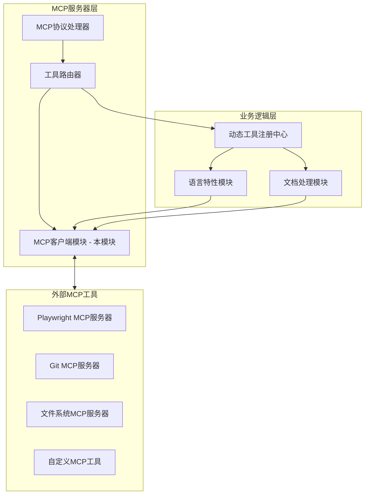
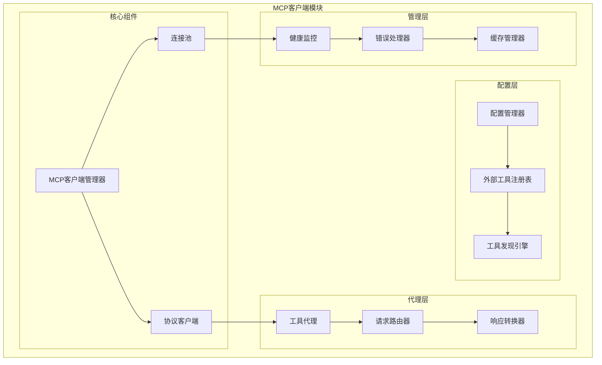
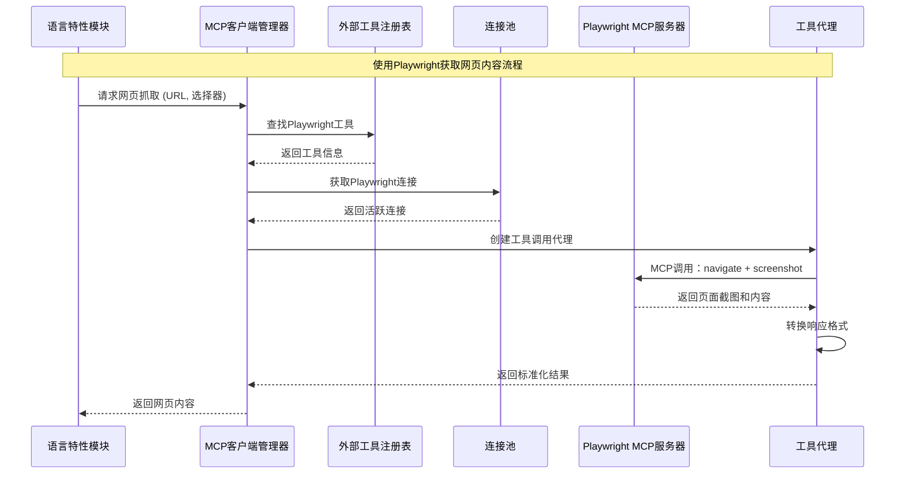
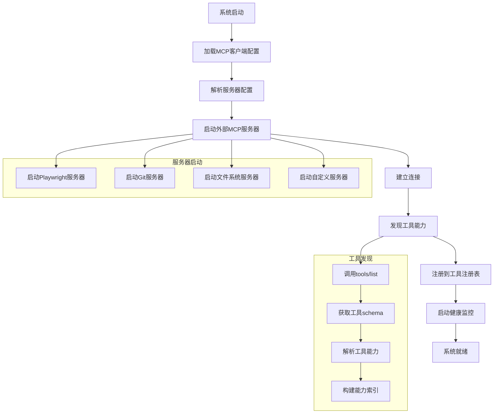
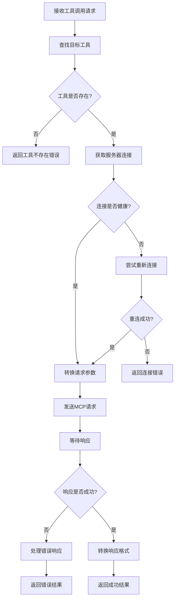
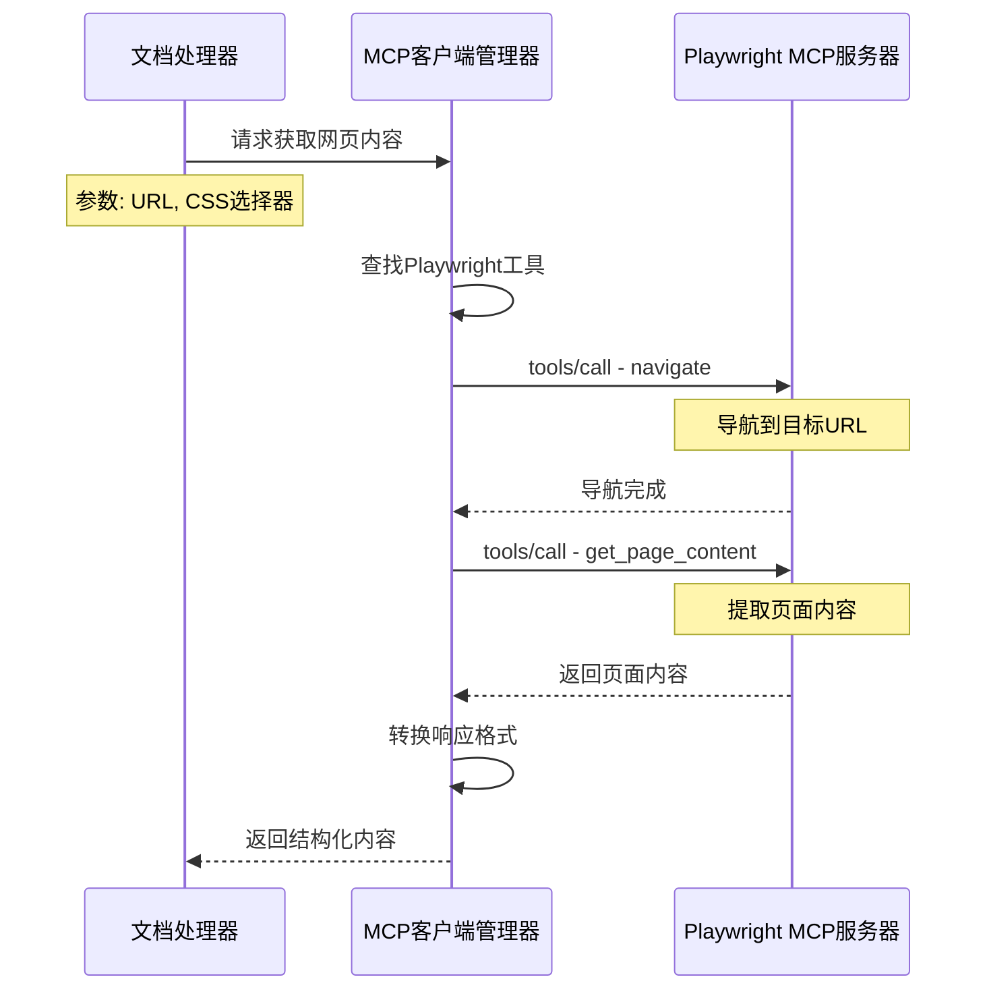
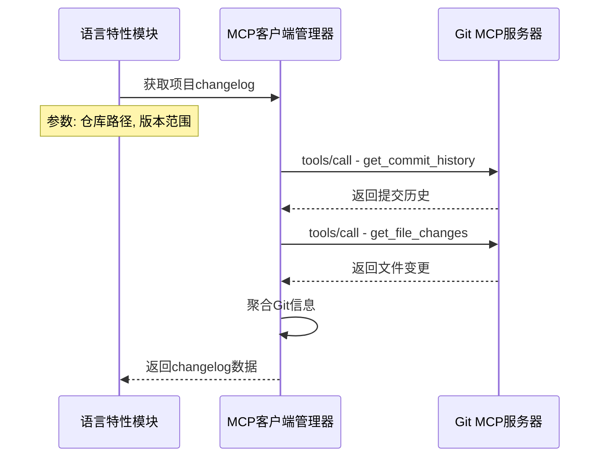

# MCP客户端模块设计文档

## 模块概览

**MCP客户端模块** 是 Grape MCP DevTools 的新增核心组件，使我们的系统能够作为MCP客户端调用外部MCP工具和服务。该模块与现有的MCP服务器功能互补，实现了双向MCP能力：既能为其他客户端提供服务，也能调用外部MCP工具来增强自身功能。

### 核心功能
- **外部工具集成**: 调用Playwright、Git、文件系统等外部MCP工具
- **配置管理**: 兼容VSCode MCP配置格式，便于工具发现和管理
- **连接管理**: 管理到多个外部MCP服务器的连接生命周期
- **工具代理**: 将外部MCP工具的能力透明地集成到内部工具链中
- **错误处理**: 优雅处理外部工具的故障和超时

### 在整体架构中的位置


## 架构设计

### 1. 模块结构图



### 2. 核心组件交互图



## 主要组件说明

### 1. MCP客户端管理器 (`mcp_client_manager.rs`)

**职责**: 作为MCP客户端模块的核心协调器，管理所有外部MCP工具的调用。

**核心功能**:
- 管理外部MCP工具的生命周期
- 协调工具调用和响应处理
- 提供统一的外部工具调用接口
- 处理工具故障和降级策略

**关键接口**:
```rust
pub struct MCPClientManager {
    tool_registry: Arc<ExternalToolRegistry>,
    connection_pool: Arc<ConnectionPool>,
    config_manager: Arc<ConfigManager>,
    health_monitor: Arc<HealthMonitor>,
}

impl MCPClientManager {
    pub async fn initialize(&self) -> Result<(), MCPClientError>;
    pub async fn call_tool(&self, tool_name: &str, params: serde_json::Value) -> Result<ToolResult, MCPClientError>;
    pub async fn list_available_tools(&self) -> Vec<ExternalToolInfo>;
    pub async fn get_tool_schema(&self, tool_name: &str) -> Option<serde_json::Value>;
    pub async fn health_check(&self, tool_name: &str) -> ToolHealthStatus;
}

pub struct ToolResult {
    pub content: serde_json::Value,
    pub metadata: ToolMetadata,
    pub execution_time: Duration,
}

pub struct ExternalToolInfo {
    pub name: String,
    pub description: String,
    pub server_id: String,
    pub schema: serde_json::Value,
    pub status: ToolStatus,
}
```

### 2. 配置管理器 (`config_manager.rs`)

**职责**: 管理MCP客户端配置，兼容VSCode MCP配置格式。

**核心功能**:
- 解析MCP配置文件（mcp_settings.json）
- 管理服务器连接参数和环境变量
- 支持配置热重载
- 验证配置有效性

**关键接口**:
```rust
pub struct ConfigManager {
    config_path: PathBuf,
    current_config: Arc<RwLock<MCPClientConfig>>,
    watchers: Vec<notify::RecommendedWatcher>,
}

impl ConfigManager {
    pub fn new(config_path: PathBuf) -> Self;
    pub async fn load_config(&self) -> Result<(), ConfigError>;
    pub async fn reload_config(&self) -> Result<(), ConfigError>;
    pub fn get_server_config(&self, server_id: &str) -> Option<ServerConfig>;
    pub fn list_servers(&self) -> Vec<String>;
}

#[derive(Debug, Clone, Deserialize)]
pub struct MCPClientConfig {
    pub mcp_servers: HashMap<String, ServerConfig>,
    pub global_settings: GlobalSettings,
}

#[derive(Debug, Clone, Deserialize)]
pub struct ServerConfig {
    pub command: String,
    pub args: Vec<String>,
    pub env: HashMap<String, String>,
    pub timeout: Option<u64>,
    pub auto_restart: Option<bool>,
}
```

**配置文件示例**:
```json
{
  "mcpServers": {
    "playwright": {
      "command": "npx",
      "args": ["@anthropics/mcp-server-playwright"],
      "env": {
        "PLAYWRIGHT_HEADLESS": "true",
        "PLAYWRIGHT_TIMEOUT": "30000"
      },
      "timeout": 60,
      "auto_restart": true
    },
    "git": {
      "command": "npx", 
      "args": ["@anthropics/mcp-server-git"],
      "env": {
        "GIT_SAFE_DIRECTORY": "*"
      }
    },
    "filesystem": {
      "command": "npx",
      "args": ["@anthropics/mcp-server-filesystem"],
      "env": {
        "ALLOWED_DIRECTORIES": "/docs,/src,/examples"
      }
    }
  },
  "globalSettings": {
    "connectionTimeout": 30,
    "maxRetries": 3,
    "healthCheckInterval": 300
  }
}
```

### 3. 连接池 (`connection_pool.rs`)

**职责**: 管理到外部MCP服务器的连接，提供连接复用和故障恢复。

**核心功能**:
- 维护到多个MCP服务器的持久连接
- 连接健康检查和自动重连
- 连接负载均衡和故障转移
- 连接生命周期管理

**关键接口**:
```rust
pub struct ConnectionPool {
    connections: Arc<RwLock<HashMap<String, Connection>>>,
    config_manager: Arc<ConfigManager>,
    health_monitor: Arc<HealthMonitor>,
}

impl ConnectionPool {
    pub async fn get_connection(&self, server_id: &str) -> Result<Arc<Connection>, ConnectionError>;
    pub async fn create_connection(&self, server_id: &str, config: &ServerConfig) -> Result<Connection, ConnectionError>;
    pub async fn close_connection(&self, server_id: &str) -> Result<(), ConnectionError>;
    pub async fn health_check_all(&self) -> HashMap<String, ConnectionHealth>;
}

pub struct Connection {
    pub server_id: String,
    pub process: Arc<Mutex<Child>>,
    pub stdin: Arc<Mutex<ChildStdin>>,
    pub stdout: Arc<Mutex<BufReader<ChildStdout>>>,
    pub created_at: Instant,
    pub last_used: Arc<Mutex<Instant>>,
}

impl Connection {
    pub async fn send_request(&self, request: MCPRequest) -> Result<MCPResponse, ConnectionError>;
    pub async fn is_healthy(&self) -> bool;
    pub async fn restart(&mut self, config: &ServerConfig) -> Result<(), ConnectionError>;
}
```

### 4. 外部工具注册表 (`external_tool_registry.rs`)

**职责**: 注册和管理外部MCP工具的元数据和能力信息。

**核心功能**:
- 发现和注册外部MCP工具
- 缓存工具schema和能力信息
- 提供工具查找和匹配服务
- 管理工具版本和兼容性

**关键接口**:
```rust
pub struct ExternalToolRegistry {
    tools: Arc<RwLock<HashMap<String, ExternalTool>>>,
    server_tools: Arc<RwLock<HashMap<String, Vec<String>>>>, // server_id -> tool_names
    capability_index: Arc<RwLock<CapabilityIndex>>,
}

impl ExternalToolRegistry {
    pub async fn discover_tools(&self, server_id: &str, connection: &Connection) -> Result<Vec<ExternalTool>, RegistryError>;
    pub async fn register_tool(&self, tool: ExternalTool) -> Result<(), RegistryError>;
    pub async fn find_tool(&self, tool_name: &str) -> Option<ExternalTool>;
    pub async fn find_tools_by_capability(&self, capability: &str) -> Vec<ExternalTool>;
    pub async fn get_server_tools(&self, server_id: &str) -> Vec<String>;
}

#[derive(Debug, Clone)]
pub struct ExternalTool {
    pub name: String,
    pub description: String,
    pub server_id: String,
    pub input_schema: serde_json::Value,
    pub capabilities: Vec<String>,
    pub last_updated: Instant,
}
```

### 5. 工具代理 (`tool_proxy.rs`)

**职责**: 为外部MCP工具提供透明的代理服务，统一调用接口。

**核心功能**:
- 将外部工具调用转换为标准MCP请求
- 处理请求参数的转换和验证
- 转换响应格式以适配内部接口
- 提供调用统计和监控

**关键接口**:
```rust
pub struct ToolProxy {
    connection_pool: Arc<ConnectionPool>,
    tool_registry: Arc<ExternalToolRegistry>,
    request_transformer: RequestTransformer,
    response_transformer: ResponseTransformer,
}

impl ToolProxy {
    pub async fn call(&self, tool_name: &str, params: serde_json::Value) -> Result<ToolResult, ProxyError>;
    pub async fn call_with_timeout(&self, tool_name: &str, params: serde_json::Value, timeout: Duration) -> Result<ToolResult, ProxyError>;
    pub async fn batch_call(&self, calls: Vec<ToolCall>) -> Vec<Result<ToolResult, ProxyError>>;
}

pub struct ToolCall {
    pub tool_name: String,
    pub params: serde_json::Value,
    pub timeout: Option<Duration>,
}

pub struct RequestTransformer;
impl RequestTransformer {
    pub fn transform(&self, tool_name: &str, params: serde_json::Value) -> Result<MCPRequest, TransformError>;
}

pub struct ResponseTransformer;
impl ResponseTransformer {
    pub fn transform(&self, response: MCPResponse) -> Result<ToolResult, TransformError>;
}
```

## 核心流程

### 1. 系统初始化流程



### 2. 工具调用流程



### 3. 实际使用场景示例

#### 场景1: 使用Playwright获取网页内容



#### 场景2: 使用Git工具获取仓库信息



## 与现有模块的集成

### 1. 语言特性模块集成

**替换自实现的网页爬虫**:
```rust
// 原有实现 (将被替换)
impl IntelligentScraper {
    async fn scrape_url(&self, url: &str) -> Result<ScrapedContent, ScraperError> {
        // 自实现的HTTP客户端和HTML解析
    }
}

// 新的实现 (使用Playwright MCP)
impl IntelligentScraper {
    async fn scrape_url(&self, url: &str) -> Result<ScrapedContent, ScraperError> {
        let params = json!({
            "url": url,
            "wait_for": "networkidle",
            "extract_content": true
        });
        
        let result = self.mcp_client.call_tool("playwright_navigate_and_extract", params).await?;
        Ok(ScrapedContent::from_mcp_result(result))
    }
}
```

### 2. 文档处理模块集成

**增强文档获取能力**:
```rust
impl DocProcessor {
    async fn fetch_remote_docs(&self, source: &DocumentSource) -> Result<RawContent, DocError> {
        match source.source_type {
            SourceType::WebPage => {
                // 使用Playwright获取动态内容
                self.mcp_client.call_tool("playwright_get_content", json!({
                    "url": source.url,
                    "selectors": source.content_selectors
                })).await
            },
            SourceType::GitRepository => {
                // 使用Git MCP获取仓库文档
                self.mcp_client.call_tool("git_get_file", json!({
                    "repo_path": source.repo_path,
                    "file_path": source.file_path,
                    "ref": source.git_ref
                })).await
            },
            _ => self.fallback_fetch(source).await
        }
    }
}
```

## 配置和部署

### 1. 环境准备

**安装外部MCP工具**:
```bash
# 安装Playwright MCP服务器
npm install -g @anthropics/mcp-server-playwright

# 安装Git MCP服务器  
npm install -g @anthropics/mcp-server-git

# 安装文件系统MCP服务器
npm install -g @anthropics/mcp-server-filesystem
```

### 2. 配置文件管理

**配置文件位置**:
- 默认: `~/.config/grape-mcp-devtools/mcp_settings.json`
- 环境变量: `GRAPE_MCP_CONFIG_PATH`
- 命令行参数: `--mcp-config`

**配置验证**:
```rust
impl ConfigManager {
    pub fn validate_config(&self, config: &MCPClientConfig) -> Result<(), ValidationError> {
        for (server_id, server_config) in &config.mcp_servers {
            // 验证命令是否存在
            if !self.command_exists(&server_config.command) {
                return Err(ValidationError::CommandNotFound {
                    server_id: server_id.clone(),
                    command: server_config.command.clone(),
                });
            }
            
            // 验证环境变量
            for (key, value) in &server_config.env {
                if value.starts_with("$") && std::env::var(&value[1..]).is_err() {
                    return Err(ValidationError::EnvVarNotFound {
                        server_id: server_id.clone(),
                        env_var: value.clone(),
                    });
                }
            }
        }
        Ok(())
    }
}
```

## 错误处理和监控

### 1. 错误类型定义

```rust
#[derive(Debug, thiserror::Error)]
pub enum MCPClientError {
    #[error("Configuration error: {message}")]
    ConfigError { message: String },
    
    #[error("Connection error for server {server_id}: {details}")]
    ConnectionError { server_id: String, details: String },
    
    #[error("Tool not found: {tool_name}")]
    ToolNotFound { tool_name: String },
    
    #[error("Tool execution failed: {tool_name}, reason: {reason}")]
    ToolExecutionFailed { tool_name: String, reason: String },
    
    #[error("Timeout waiting for response from {server_id}")]
    TimeoutError { server_id: String },
    
    #[error("Protocol error: {message}")]
    ProtocolError { message: String },
}
```

### 2. 健康监控

```rust
pub struct HealthMonitor {
    connection_pool: Arc<ConnectionPool>,
    metrics: Arc<Mutex<HealthMetrics>>,
    check_interval: Duration,
}

impl HealthMonitor {
    pub async fn start_monitoring(&self) {
        let mut interval = tokio::time::interval(self.check_interval);
        
        loop {
            interval.tick().await;
            self.perform_health_checks().await;
        }
    }
    
    async fn perform_health_checks(&self) {
        let health_results = self.connection_pool.health_check_all().await;
        
        for (server_id, health) in health_results {
            match health.status {
                HealthStatus::Healthy => {
                    self.metrics.lock().unwrap().record_success(&server_id);
                },
                HealthStatus::Unhealthy => {
                    self.metrics.lock().unwrap().record_failure(&server_id);
                    self.attempt_recovery(&server_id).await;
                }
            }
        }
    }
}
```

## 性能优化

### 1. 连接复用
- 维护长期连接，避免频繁启动进程
- 连接池大小根据负载动态调整
- 空闲连接自动清理

### 2. 请求缓存
- 缓存工具schema和能力信息
- 缓存常用工具调用结果
- 智能缓存失效策略

### 3. 并发控制
- 限制同时连接数量
- 请求队列和优先级管理
- 背压控制机制

## 测试策略

### 1. 单元测试
- Mock外部MCP服务器
- 配置解析和验证测试
- 错误处理场景测试

### 2. 集成测试
- 真实MCP工具集成测试
- 端到端工具调用测试
- 故障恢复测试

### 3. 性能测试
- 并发调用压力测试
- 连接池性能测试
- 内存和资源使用测试 