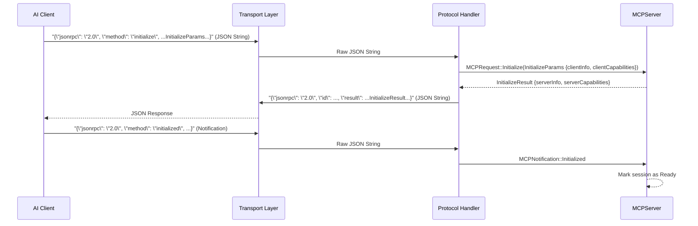
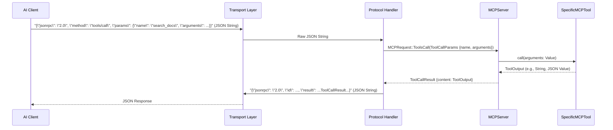
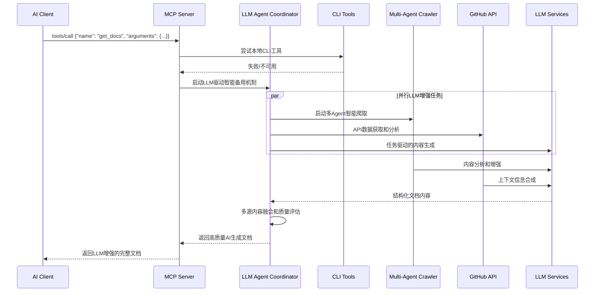

# MCP协议模块设计文档

## 模块概览

MCP协议模块是Grape MCP DevTools的核心通信层，负责实现完整的MCP (Model Context Protocol) 协议支持，处理与AI编程助手的所有通信交互。

### 模块基本信息
- **模块路径**: `src/mcp/` (主要包括 `server.rs`, `protocol.rs`, `types.rs`)
- **主要作用**: MCP协议实现、客户端通信、JSON-RPC消息处理、请求分发
- **依赖协议**: MCP v2025-03-26 (或项目中定义的具体版本)
- **通信方式**: 主要通过 `stdio` (标准输入/输出) 进行JSON-RPC 2.0通信，设计上应考虑未来通过 `socket` 扩展。
- **支持核心MCP特性**:
    - 初始化: `initialize`, `initialized`
    - 工具交互: `tools/list`, `tools/call`
    - 生命周期: `shutdown`, `exit`
    - 控制消息: `$/cancelRequest`
    - (可选/未来) 资源管理: `resources/list`, `resources/read`
    - (可选/未来) 提示符系统: `prompts/list`, `prompts/get`

## 架构设计

### 1. 模块结构

```
src/mcp/
├── mod.rs              # 模块导出和配置
├── server.rs           # MCP服务器核心实现 (MCPServer,主服务循环,请求分发)
├── protocol.rs         # MCP协议消息结构定义与序列化/反序列化 (使用serde_json)
└── types.rs            # 定义协议中使用的各种自定义数据结构 (如 ToolInfo, InitializeParams, ServerCapabilities等)
```

### 2. 核心组件架构

```
┌─────────────────────────────────────────────────────────┐
│                   MCP 协议模块                           │
│  ┌─────────────────┬─────────────────┬─────────────────┐ │
│  │ Transport Layer │ Protocol Handler│   Server Core   │ │
│  │ (stdio_transport.rs)│ (protocol.rs)   │   (server.rs)   │ │
│  │ (Reads stdin,   │ (JSON-RPC parse/│   (MCPServer)   │ │
│  │  Writes stdout) │  serialize, MCP │                 │ │
│  │                 │  Msg validation)│                 │ │
│  └──────┬──────────┴────────┬────────┴────────┬────────┘ │
│         │ Raw JSON String   │ MCPRequest      │          │
│         └──────────────────►│ Struct          │          │
│                             └────────────────►│          │
│                                               │ Tool Call│
│                                               ▼          │
│  ┌─────────────────┬─────────────────┬─────────────────┐ │
│  │ Tool Manager    │ Message Router  │   Error Handler │ │
│  │ (Part of Server │ (Part of Server │   (Centralized  │ │
│  │  Core or sep.)  │  Core)          │    Error Logic) │ │
│  └─────────────────┴─────────────────┴─────────────────┘ │
└─────────────────────────────────────────────────────────┘
```

### 3. 主要组件说明

#### 3.1 MCPServer (`server.rs`)
**功能**: MCP服务器的核心实现，作为主服务循环，监听来自`Transport Layer`的消息，并将解析后的请求分发给相应的处理逻辑或工具。
- 处理客户端连接和初始化 (`initialize` 方法)。
- 管理已注册的工具实例 (可能通过一个`ToolManager`组件或内部数据结构)，并执行工具的`call`方法。
- 维护服务器能力 (`ServerCapabilities`) 和会话相关的基本信息 (如客户端信息)。
- 协调关闭流程 (`shutdown`, `exit`)。

**关键接口/逻辑**:
```rust
// pub struct MCPServer {
//     tools: Arc<RwLock<HashMap<String, Arc<dyn MCPTool + Send + Sync>>>>, // Tool instances managed here or by ToolManager
//     capabilities: ServerCapabilities,
//     session_state: Arc<RwLock<SessionState>>,
//     // ... other fields like a channel sender for responses
// }

// impl MCPServer {
    // pub async fn run(&self) // Main server loop, reads from transport, processes, sends responses
    // async fn handle_raw_message(&self, raw_json: String) -> Option<String> // Parses and dispatches internally
    // async fn process_mcp_request(&self, request: MCPRequest) -> MCPResponse // Core request dispatch logic

    // Protocol method handlers:
    // async fn initialize(&self, params: InitializeParams) -> Result<InitializeResult, MCPErrorResponse>
    // async fn list_tools(&self, params: Option<ListToolsParams>) -> Result<ListToolsResult, MCPErrorResponse>
    // async fn call_tool(&self, params: ToolCallParams) -> Result<ToolCallResult, MCPErrorResponse>
    // async fn shutdown(&self) -> Result<(), MCPErrorResponse>
    // fn exit(&self) // Handles exit notification
// }
```

#### 3.2 Protocol Handler (`protocol.rs`, `types.rs`)
**功能**: MCP协议消息的结构定义、序列化与反序列化，以及初步的验证。
- 使用 `serde` 和 `serde_json` 将来自`Transport Layer`的JSON字符串解析为具体的 `MCPRequest` 枚举/结构体 (如 `MCPRequest::Initialize(InitializeParams)`, `MCPRequest::ToolsCall(ToolCallParams)` )。
- 将 `MCPServer` 处理后产生的 `MCPResponse` 枚举/结构体 (如 `MCPResponse::Initialize(InitializeResult)`, `MCPResponse::Error(MCPErrorResponse)`) 序列化为JSON字符串以供`Transport Layer`发送。
- 定义所有MCP消息、参数和结果的Rust结构体 (在 `types.rs` 中)。

**支持的协议方法 (示例)**:
- `initialize`: (Notification or Request/Response) 客户端与服务器握手，交换能力。客户端发送 `InitializeParams` (含 `clientInfo`, `clientCapabilities`)，服务器响应 `InitializeResult` (含 `serverInfo`, `serverCapabilities`)。
- `initialized`: (Notification) 客户端通知服务器其已完成初始化设置。
- `shutdown`: (Request/Response) 客户端请求服务器准备关闭。服务器完成清理后响应。
- `exit`: (Notification) 客户端通知服务器即将退出，服务器也应退出。
- `tools/list`: (Request/Response) 客户端请求当前可用的工具列表。服务器返回 `ListToolsResult`，包含 `Vec<ToolInfo>`。
- `tools/call`: (Request/Response) 客户端请求调用指定工具。参数为 `ToolCallParams` (含 `name`, `arguments`)，服务器返回 `ToolCallResult` (含工具执行输出) 或错误。
- `$/cancelRequest`: (Notification) 客户端通知服务器取消之前发送的某个请求 (通过请求ID)。

#### 3.3 Transport Layer (e.g., `stdio_transport.rs` - hypothetical)
**功能**: 负责底层通信，目前主要是通过标准输入/输出。
- 从 `stdin` 异步读取数据块，按行或按JSON对象边界分割消息。
- 将序列化后的JSON响应字符串异步写入 `stdout`。
- 未来可以扩展为支持TCP/IP Sockets或其他IPC机制。

### 4. 数据流处理

#### 4.1 初始化流程


#### 4.2 工具调用流程


### 5. 协议消息格式 (`types.rs` 中定义)

#### 5.1 初始化消息 (`InitializeParams`, `InitializeResult`)
```rust
// types.rs
#[derive(Debug, Clone, Serialize, Deserialize)]
pub struct ClientInfo {
    pub name: String,
    pub version: Option<String>,
}

#[derive(Debug, Clone, Serialize, Deserialize, Default)]
pub struct ClientCapabilities { // Client announces what it can do
    // e.g., pub workspace: Option<WorkspaceClientCapabilities>,
    pub tools: Option<ToolsClientCapabilities>,
}

#[derive(Debug, Clone, Serialize, Deserialize)]
pub struct InitializeParams {
    #[serde(rename = "protocolVersion")]
    pub protocol_version: String, // e.g., "2025-03-26"
    #[serde(rename = "clientInfo")]
    pub client_info: Option<ClientInfo>,
    pub capabilities: ClientCapabilities,
    // ... other fields like processId, rootUri, etc.
}

#[derive(Debug, Clone, Serialize, Deserialize)]
pub struct ServerInfo {
    pub name: String,
    pub version: String,
}

#[derive(Debug, Clone, Serialize, Deserialize, Default)]
pub struct ServerCapabilities { // Server announces what it can do
    pub tools: Option<ToolsCapability>,
    // pub resources: Option<ResourcesCapability>,
    // pub prompts: Option<PromptsCapability>,
    // pub experimental: Option<HashMap<String, Value>>,
}

#[derive(Debug, Clone, Serialize, Deserialize)]
pub struct InitializeResult {
    #[serde(rename = "protocolVersion")]
    pub protocol_version: String, 
    #[serde(rename = "serverInfo")]
    pub server_info: ServerInfo,
    pub capabilities: ServerCapabilities,
}
```

#### 5.2 工具相关消息 (`ToolInfo`, `ListToolsResult`, `ToolCallParams`, `ToolCallResult`)
```rust
// types.rs
#[derive(Debug, Clone, Serialize, Deserialize)]
pub struct ToolInfo {
    pub name: String,
    pub description: String,
    #[serde(rename = "inputSchema")]
    pub input_schema: Value, // JSON Schema for tool arguments
    // pub output_schema: Option<Value>, // (Optional) JSON Schema for tool output
}

#[derive(Debug, Clone, Serialize, Deserialize)]
pub struct ListToolsResult {
    pub tools: Vec<ToolInfo>,
}

#[derive(Debug, Clone, Serialize, Deserialize)]
pub struct ToolCallParams {
    pub name: String,        // Name of the tool to call
    pub arguments: Value,    // Arguments for the tool, matching its inputSchema
}

#[derive(Debug, Clone, Serialize, Deserialize)]
pub struct ToolCallResult {
    pub content: Value, // Output from the tool, typically a JSON object or string
    // pub artifacts: Option<Vec<ToolArtifact>> // (Optional) For tools generating files/images
}
```

### 6. 错误处理机制

#### 6.1 错误类型定义 (`MCPError` / `MCPErrorResponse`)
- Aligns with JSON-RPC 2.0 error codes and structure.
```rust
// types.rs
#[derive(Debug, Clone, Serialize, Deserialize, thiserror::Error)]
#[error("MCP Error ({code}): {message}")]
pub struct MCPErrorResponse {
    pub code: i32,
    pub message: String,
    pub data: Option<Value>, // Additional info about the error
}

// JSON-RPC 2.0 Standard Error Codes
pub const PARSE_ERROR: i32 = -32700;
pub const INVALID_REQUEST: i32 = -32600;
pub const METHOD_NOT_FOUND: i32 = -32601;
pub const INVALID_PARAMS: i32 = -32602;
pub const INTERNAL_ERROR: i32 = -32603;

// Custom MCP Error Codes (example, to be defined in a range)
pub const TOOL_EXECUTION_ERROR: i32 = -32000;
pub const SERVER_NOT_INITIALIZED: i32 = -32002;
// ... more custom errors

impl MCPErrorResponse {
    // Constructors for common errors
    // pub fn new(code: i32, message: String, data: Option<Value>) -> Self { ... }
    // pub fn invalid_params(details: String) -> Self { ... }
    // pub fn tool_error(tool_name: &str, reason: String) -> Self { ... }
}
```

#### 6.2 错误响应格式 (JSON-RPC 2.0)
```json
{
  "jsonrpc": "2.0",
  "id": "request_id_or_null_for_notification_errors",
  "error": {
    "code": -32602,
    "message": "Invalid params",
    "data": "Missing required argument 'query' for tool 'search_docs'"
  }
}
```

### 7. 能力集管理 (`ServerCapabilities`, `ClientCapabilities`)

#### 7.1 服务器能力 (`ServerCapabilities` in `types.rs`)
- `tools: Option<ToolsCapability>`: Indicates tool-related capabilities.
    - `ToolsCapability { list_changed: bool }`: If `true`, client should be aware that the `tools/list` result can change dynamically (e.g., due to `DynamicToolRegistry` rescans).
- Other capabilities for resources, prompts, etc., can be added similarly.

#### 7.2 客户端能力 (`ClientCapabilities` in `types.rs`)
- Client declares what MCP features or extensions it supports.
- `tools: Option<ToolsClientCapabilities>`: Example: `ToolsClientCapabilities { dynamic_registration: bool }` (if client supports server pushing tool list updates).

#### 7.3 动态能力协商
- During `initialize`, client sends its capabilities, and server responds with its capabilities.
- Both sides should only use features mutually supported, or handle missing capabilities gracefully.
- Server dynamically generates its `ServerCapabilities` based on its current configuration and registered tools (e.g., if no tools are registered that use resources, `resources` capability might be null or absent).

### 8. 会话状态管理

- MCP is largely request-response based, but `initialize` establishes a conceptual session.
- **`SessionState` (internal to `MCPServer`)**: Can be simple, e.g., `Uninitialized`, `Initializing`, `Ready`, `ShuttingDown`, `Shutdown`.
- **`SessionData` (internal to `MCPServer`)**: Stores client-provided info after `initialize`:

## 🤖 任务驱动的AI文档生成系统

### 9. 智能备用策略架构

#### 9.1 CLI失败时的LLM驱动AI代理启动流程


#### 9.2 LLM驱动的任务分析引擎

```rust
pub struct LLMTaskAnalysisEngine {
    // LLM服务集成
    llm_orchestrator: Arc<LLMOrchestrator>,
    prompt_manager: Arc<PromptManager>,
    
    // 任务分析组件
    intent_analyzer: Arc<IntentAnalyzer>,
    context_builder: Arc<ContextBuilder>,
    strategy_planner: Arc<StrategyPlanner>,
    
    // MCP客户端管理
    mcp_client_manager: Arc<MCPClientManager>,
}

impl LLMTaskAnalysisEngine {
    pub async fn analyze_documentation_request(&self, request: &DocRequest) -> AnalysisResult {
        // 第一步：LLM深度理解用户意图
        let intent_analysis = self.analyze_intent_with_llm(request).await?;
        
        // 第二步：LLM构建技术上下文
        let tech_context = self.build_context_with_llm(request, &intent_analysis).await?;
        
        // 第三步：LLM制定最优策略
        let strategy = self.plan_strategy_with_llm(&intent_analysis, &tech_context).await?;
        
        AnalysisResult {
            user_intent: intent_analysis,
            technical_context: tech_context,
            execution_strategy: strategy,
            confidence_score: self.calculate_confidence(&intent_analysis, &strategy),
        }
    }
    
    async fn analyze_intent_with_llm(&self, request: &DocRequest) -> UserIntent {
        let prompt = format!(
            "深度分析用户的文档需求意图：
            
            编程语言: {}
            目标技术: {}
            内容类型: {:?}
            用户查询: {}
            
            请分析：
            1. 用户的技能水平（初学者/中级/高级）
            2. 具体的学习或使用目标
            3. 偏好的内容深度和格式
            4. 可能的使用场景和上下文
            5. 紧急程度和重要性
            
            返回JSON格式的意图分析。",
            request.language,
            request.target,
            request.content_type,
            request.query.as_deref().unwrap_or("")
        );
        
        let llm_response = self.llm_orchestrator.generate_structured_response(
            &prompt,
            &json_schema_for_intent_analysis()
        ).await?;
        
        UserIntent::from_llm_response(llm_response)
    }
    
    async fn build_context_with_llm(&self, request: &DocRequest, intent: &UserIntent) -> TechnicalContext {
        let prompt = format!(
            "构建技术上下文以指导文档获取：
            
            技术目标: {}
            语言生态: {}
            用户意图: {:?}
            
            请分析：
            1. 该技术的生态系统特点
            2. 主要的文档来源和权威性排序
            3. 相关的依赖和配套技术
            4. 常见的学习路径和难点
            5. 最佳的文档组织方式
            
            返回JSON格式的技术上下文。",
            request.target,
            request.language,
            intent
        );
        
        let llm_response = self.llm_orchestrator.generate_structured_response(
            &prompt,
            &json_schema_for_technical_context()
        ).await?;
        
        TechnicalContext::from_llm_response(llm_response)
    }
}
```

#### 9.3 LLM增强的多Agent协调系统

```rust
pub struct LLMMultiAgentCoordinator {
    // 核心LLM组件
    llm_orchestrator: Arc<LLMOrchestrator>,
    
    // LLM驱动的专业Agent
    url_discovery_agent: Arc<LLMURLDiscoveryAgent>,
    content_extraction_agent: Arc<LLMContentExtractionAgent>,
    content_synthesis_agent: Arc<LLMContentSynthesisAgent>,
    quality_assessment_agent: Arc<LLMQualityAssessmentAgent>,
    
    // Agent协调配置
    coordination_config: CoordinationConfig,
}

impl LLMMultiAgentCoordinator {
    pub async fn execute_documentation_task(&self, analysis: &AnalysisResult) -> DocumentationResult {
        // 第一阶段：LLM指导的URL发现和验证
        let discovered_sources = self.url_discovery_agent
            .discover_with_llm_guidance(&analysis)
            .await?;
        
        // 第二阶段：LLM增强的并行内容提取
        let extraction_tasks = discovered_sources.into_iter()
            .map(|source| self.content_extraction_agent.extract_with_llm(source))
            .collect::<Vec<_>>();
        
        let extracted_contents = futures::try_join_all(extraction_tasks).await?;
        
        // 第三阶段：LLM驱动的内容合成和优化
        let synthesized_content = self.content_synthesis_agent
            .synthesize_with_llm(extracted_contents, analysis)
            .await?;
        
        // 第四阶段：LLM质量评估和改进
        let quality_report = self.quality_assessment_agent
            .assess_with_llm(&synthesized_content, analysis)
            .await?;
        
        DocumentationResult {
            content: synthesized_content,
            quality_score: quality_report.overall_score,
            sources: quality_report.source_reliability,
            processing_metadata: self.create_metadata(&analysis, &quality_report),
        }
    }
}
```

#### 9.4 基于Playwright MCP的智能页面处理

```rust
pub struct PlaywrightLLMIntegration {
    mcp_client: Arc<MCPClientManager>,
    llm_orchestrator: Arc<LLMOrchestrator>,
}

impl PlaywrightLLMIntegration {
    pub async fn extract_page_with_llm_guidance(&self, url: &str, context: &ExtractionContext) -> ExtractedPage {
        // 第一步：LLM分析页面类型和提取策略
        let page_strategy = self.analyze_page_with_llm(url, context).await?;
        
        // 第二步：使用Playwright执行LLM指导的提取
        let raw_content = self.execute_playwright_extraction(&page_strategy).await?;
        
        // 第三步：LLM后处理和内容优化
        let optimized_content = self.optimize_content_with_llm(&raw_content, &page_strategy).await?;
        
        ExtractedPage {
            url: url.to_string(),
            content: optimized_content,
            extraction_metadata: page_strategy.metadata,
            confidence_score: self.calculate_extraction_confidence(&optimized_content),
        }
    }
    
    async fn analyze_page_with_llm(&self, url: &str, context: &ExtractionContext) -> PageExtractionStrategy {
        // 先获取页面基本信息
        let page_preview = self.get_page_preview(url).await?;
        
        let prompt = format!(
            "分析网页并制定最优提取策略：
            
            URL: {}
            内容目标: {:?}
            页面预览: {}
            
            请制定：
            1. 最佳的CSS选择器组合
            2. 需要等待的动态内容
            3. 可能的反爬虫措施应对
            4. 内容清洗的重点区域
            5. 子页面发现的策略
            
            返回详细的提取策略JSON。",
            url,
            context.target_content,
            page_preview.summary
        );
        
        let llm_response = self.llm_orchestrator.generate_structured_response(
            &prompt,
            &json_schema_for_extraction_strategy()
        ).await?;
        
        PageExtractionStrategy::from_llm_response(llm_response)
    }
    
    async fn execute_playwright_extraction(&self, strategy: &PageExtractionStrategy) -> RawPageContent {
        let params = json!({
            "url": strategy.target_url,
            "selectors": strategy.css_selectors,
            "wait_for": strategy.wait_conditions,
            "extract_links": strategy.extract_links,
            "handle_dynamic": strategy.dynamic_handling,
            "timeout": strategy.timeout_ms
        });
        
        let result = self.mcp_client.call_tool("playwright", "extract_advanced", params).await?;
        RawPageContent::from_mcp_result(result)
    }
    
    async fn optimize_content_with_llm(&self, raw: &RawPageContent, strategy: &PageExtractionStrategy) -> OptimizedContent {
        let prompt = format!(
            "优化提取的网页内容：
            
            原始文本: {}
            HTML结构: {}
            提取目标: {:?}
            
            请执行：
            1. 移除无关的UI元素和广告
            2. 修复格式问题和换行
            3. 提取和增强代码块
            4. 保留重要的结构和链接
            5. 添加适当的标记和注释
            
            返回清洁优化的内容。",
            raw.text.chars().take(2000).collect::<String>(),
            raw.html.chars().take(1000).collect::<String>(),
            strategy.target_content
        );
        
        let optimized_text = self.llm_orchestrator.generate_completion(&prompt).await
            .unwrap_or_else(|_| raw.text.clone());
        
        OptimizedContent {
            text: optimized_text,
            code_blocks: self.extract_code_blocks_with_llm(&optimized_text).await,
            structure: self.analyze_structure_with_llm(&optimized_text).await,
            metadata: self.create_content_metadata(raw, strategy),
        }
    }
}
```

### 10. 高级智能爬虫实现

#### 10.1 多层智能爬取架构
```rust
// 智能爬虫引擎
pub struct IntelligentScrapingEngine {
    // 核心爬虫能力
    web_crawler: Arc<AdvancedWebCrawler>,
    content_analyzer: Arc<ContentAnalyzer>,
    pattern_recognizer: Arc<PatternRecognizer>,
    
    // AI增强功能
    semantic_analyzer: Arc<SemanticAnalyzer>,
    content_quality_assessor: Arc<ContentQualityAssessor>,
    relevance_scorer: Arc<RelevanceScorer>,
    
    // 动态适应能力
    learning_engine: Arc<LearningEngine>,
    feedback_processor: Arc<FeedbackProcessor>,
}

// 智能爬取策略
pub enum IntelligentScrapingStrategy {
    SemanticCrawling,        // 语义驱动爬取
    StructuredExtraction,    // 结构化提取
    ContentDiscovery,        // 内容发现
    QualityFiltering,        // 质量过滤
    ContextualMapping,       // 上下文映射
}
```

#### 10.2 AI驱动的内容识别和提取
```rust
impl AdvancedWebCrawler {
    pub async fn intelligent_crawl(&self, target: CrawlTarget) -> CrawlResult {
        // 1. 智能URL生成和发现
        let urls = self.discover_relevant_urls(target).await?;
        
        // 2. 内容类型预测和验证
        let validated_urls = self.predict_and_validate_content(urls).await?;
        
        // 3. 智能爬取和提取
        let mut crawl_results = Vec::new();
        for url in validated_urls {
            let content = self.extract_intelligent_content(url).await?;
            let analyzed = self.analyze_content_semantics(content).await?;
            crawl_results.push(analyzed);
        }
        
        // 4. AI驱动的内容融合
        let synthesized = self.synthesize_content(crawl_results).await?;
        
        CrawlResult {
            content: synthesized,
            quality_score: self.assess_quality(&synthesized).await?,
            confidence: self.calculate_confidence(&synthesized),
            sources: self.extract_source_metadata(&crawl_results),
        }
    }
    
    async fn extract_intelligent_content(&self, url: Url) -> Result<ExtractedContent> {
        // 使用AI识别页面结构和内容类型
        let page_structure = self.analyze_page_structure(&url).await?;
        
        match page_structure.content_type {
            ContentType::Documentation => {
                self.extract_documentation_content(&url, &page_structure).await
            },
            ContentType::Changelog => {
                self.extract_changelog_content(&url, &page_structure).await
            },
            ContentType::Examples => {
                self.extract_example_content(&url, &page_structure).await
            },
            ContentType::API => {
                self.extract_api_content(&url, &page_structure).await
            },
            // ... 其他内容类型
        }
    }
}
```

### 11. LLM驱动的文档生成

#### 11.1 智能提示词工程
```rust
// LLM服务集成
pub struct LLMDocumentationService {
    openai_client: Arc<OpenAIClient>,
    anthropic_client: Arc<AnthropicClient>,
    prompt_engineer: Arc<PromptEngineer>,
    response_processor: Arc<ResponseProcessor>,
}

impl LLMDocumentationService {
    pub async fn generate_documentation(&self, context: DocumentationContext) -> LLMResult {
        // 1. 动态提示词生成
        let prompt = self.prompt_engineer.create_documentation_prompt(context).await?;
        
        // 2. 多模型并行生成
        let results = futures::join!(
            self.generate_with_openai(&prompt),
            self.generate_with_anthropic(&prompt),
        );
        
        // 3. 结果融合和质量评估
        let best_result = self.select_best_result(results).await?;
        
        // 4. 后处理和格式化
        self.post_process_documentation(best_result).await
    }
    
    async fn create_context_aware_prompt(&self, task: &DocumentationTask) -> String {
        format!(
            r#"
你是一个专业的技术文档生成专家。请基于以下信息生成高质量的技术文档：

## 任务背景
- 编程语言: {}
- 目标库/框架: {}
- 文档类型: {}
- 用户技能水平: {}

## 可用信息源
{}

## 生成要求
1. 提供完整的安装和配置指南
2. 包含实用的代码示例
3. 解释核心概念和最佳实践
4. 提供故障排除指南
5. 格式化为Markdown
6. 确保信息准确性和时效性

## 输出格式
请以标准Markdown格式输出，包含适当的标题层级、代码块和链接。

开始生成文档：
"#,
            task.language,
            task.target,
            task.doc_type,
            task.user_level,
            task.available_sources.join("\n")
        )
    }
}
```

#### 11.2 多阶段内容生成流程
```rust
// 多阶段文档生成
impl DocumentAssembler {
    pub async fn assemble_comprehensive_documentation(&self, 
        raw_sources: Vec<ContentSource>,
        user_intent: UserIntent
    ) -> AssembledDocumentation {
        
        // 阶段1: 内容分析和分类
        let analyzed_content = self.analyze_content_sources(raw_sources).await?;
        
        // 阶段2: 上下文构建
        let context = self.build_documentation_context(analyzed_content, user_intent).await?;
        
        // 阶段3: AI增强生成
        let generated_sections = self.generate_documentation_sections(context).await?;
        
        // 阶段4: 质量验证和优化
        let validated_content = self.validate_and_optimize(generated_sections).await?;
        
        // 阶段5: 最终组装
        let final_doc = self.assemble_final_documentation(validated_content).await?;
        
        AssembledDocumentation {
            content: final_doc,
            quality_metrics: self.calculate_quality_metrics(&final_doc),
            generation_metadata: self.create_metadata(),
            source_attribution: self.create_attribution(raw_sources),
        }
    }
}
```

### 12. 质量保证和智能评估

#### 12.1 AI驱动的质量评估
```rust
// 质量评估系统
pub struct DocumentationQualityAssessor {
    accuracy_checker: Arc<AccuracyChecker>,
    completeness_analyzer: Arc<CompletenessAnalyzer>,
    readability_scorer: Arc<ReadabilityScorer>,
    technical_validator: Arc<TechnicalValidator>,
}

impl DocumentationQualityAssessor {
    pub async fn assess_quality(&self, documentation: &Documentation) -> QualityAssessment {
        let metrics = futures::join!(
            self.accuracy_checker.check_accuracy(documentation),
            self.completeness_analyzer.analyze_completeness(documentation),
            self.readability_scorer.score_readability(documentation),
            self.technical_validator.validate_technical_content(documentation),
        );
        
        QualityAssessment {
            overall_score: self.calculate_overall_score(&metrics),
            accuracy_score: metrics.0?,
            completeness_score: metrics.1?,
            readability_score: metrics.2?,
            technical_score: metrics.3?,
            improvement_suggestions: self.generate_suggestions(&metrics),
        }
    }
}
```

#### 12.2 自适应学习和改进机制
```rust
// 自适应学习系统
pub struct AdaptiveLearningEngine {
    feedback_collector: Arc<FeedbackCollector>,
    pattern_learner: Arc<PatternLearner>,
    strategy_optimizer: Arc<StrategyOptimizer>,
}

impl AdaptiveLearningEngine {
    pub async fn learn_from_usage(&self, usage_data: UsageData) -> LearningResult {
        // 收集用户反馈和使用模式
        let feedback = self.feedback_collector.collect_feedback(usage_data).await?;
        
        // 学习成功模式
        let patterns = self.pattern_learner.learn_patterns(feedback).await?;
        
        // 优化生成策略
        let optimized_strategies = self.strategy_optimizer.optimize(patterns).await?;
        
        LearningResult {
            learned_patterns: patterns,
            optimized_strategies,
            confidence_improvement: self.calculate_improvement(&feedback),
        }
    }
}
```

### 13. 实际应用场景

#### 13.1 新兴技术栈的智能文档生成
当AI系统遇到训练时未覆盖的新技术：
1. **任务分析**: AI分析用户需求，识别技术栈和文档类型
2. **智能搜索**: 自动发现相关的官方文档、GitHub仓库、博客文章
3. **内容提取**: 使用NLP技术提取关键信息和代码示例
4. **AI合成**: 利用LLM生成结构化、可读性强的技术文档
5. **质量验证**: 多维度质量评估，确保信息准确性和实用性

#### 13.2 上下文感知的个性化文档
- **技能水平适配**: 根据用户技能水平调整文档深度和复杂度
- **项目上下文**: 结合当前项目的技术栈提供针对性建议
- **使用模式学习**: 学习用户偏好，优化文档结构和内容focus

#### 13.3 实时技术趋势跟踪
- **自动监控**: 实时监控GitHub趋势、技术博客、社区讨论
- **智能分析**: AI分析技术变化趋势和最佳实践演进
- **动态更新**: 自动更新文档内容，保持信息的时效性

## 🎯 实际应用场景

### 14. 典型使用场景

#### 14.1 新兴技术栈支持
当AI系统遇到训练时未覆盖的新技术：
1. 检测到未知包/框架请求
2. 启动多源信息采集
3. AI分析和内容合成
4. 生成结构化技术指导

#### 14.2 实时技术更新
- 监控GitHub releases和changelog
- 自动检测API breaking changes
- 生成版本迁移指南
- 推送关键技术更新

#### 14.3 上下文感知推荐
- 基于项目技术栈的智能推荐
- 相关技术和最佳实践建议
- 潜在问题和解决方案预警

### 15. 性能优化

#### 15.1 消息处理优化
- **Asynchronous Operations**: All I/O (stdin/stdout, tool execution if it involves I/O) is handled asynchronously using `tokio`.
- **Concurrent Request Handling**: Each incoming request can be spawned as a separate `tokio::task` to allow concurrent processing, preventing one slow tool call from blocking others.
- **Efficient Serialization**: `serde_json` is generally efficient. For very high-throughput scenarios, alternative JSON libraries or binary protocols could be considered (but JSON-RPC is standard for MCP).

#### 15.2 内存管理
- Minimize unnecessary cloning of large data structures (e.g., tool arguments, results) by using references (`&`) where possible within a request's lifecycle.
- Use `Arc` for shared, read-only data like `ToolInfo` or `ServerCapabilities` if they need to be accessed by multiple concurrent tasks.

### 16. 安全考虑

#### 16.1 输入验证
- **JSON Schema for Tool Arguments**: Crucially, the `input_schema` provided by each tool in `ToolInfo` MUST be used by `MCPServer` (or the `ToolManager`) to validate the `arguments` field of a `tools/call` request before actually calling the tool. This prevents malformed or malicious inputs from reaching tool-specific code directly.
- **Sanitization**: If tool arguments are strings that might be used in paths, commands, or queries, they should be appropriately sanitized by the respective tools (though validation against a schema is the first line of defense).

#### 16.2 资源保护
- **Tool Execution Timeout**: Long-running tool calls can block server resources. Consider implementing a configurable timeout mechanism for `tools/call` execution. If a tool exceeds its timeout, it can be cancelled and an error returned to the client.
- **Concurrency Limits**: If certain tools are resource-intensive, `MCPServer`