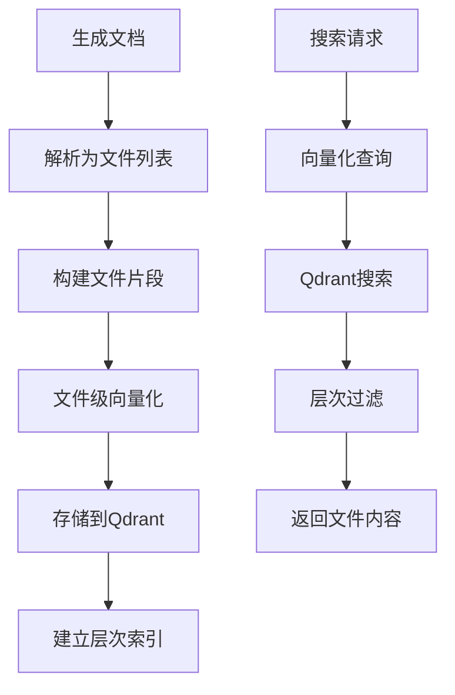

# MCP 多语言文档服务

## 项目概述

grape-mcp-devtools 是一个基于 Model Context Protocol (MCP) 的多语言文档服务，采用**文件级向量化**策略，为 AI 助手提供准确、高效的编程库文档检索能力。

### 核心设计原则

1. **文件级粒度**：以完整文件为最小处理单位，避免复杂的代码解析
2. **树形结构保持**：在向量数据库中保持文件的层次结构和路径信息
3. **语言无关**：依赖各语言的标准文档生成工具，而非自研解析器
4. **实时生成**：文档不存在时本地生成并向量化存储

## 技术架构

```
grape-mcp-devtools/
├── src/
│   ├── docgen/           # 文档生成模块
│   │   ├── base.rs       # 文档生成基础接口
│   │   ├── formats/      # 格式解析器
│   │   │   ├── html.rs   # HTML文档解析
│   │   │   ├── md.rs     # Markdown解析
│   │   │   └── json.rs   # JSON格式解析
│   │   └── langs/        # 语言特定实现
│   │       ├── go/       # Go语言文档生成
│   │       ├── rust/     # Rust语言文档生成
│   │       ├── python/   # Python语言文档生成
│   │       ├── js/       # JavaScript/TypeScript
│   │       ├── java/     # Java语言文档生成
│   │       └── dart/     # Dart/Flutter文档生成
│   │
│   ├── vectorization/    # 向量化处理
│   │   ├── mod.rs
│   │   ├── embeddings.rs # 文件级向量化
│   │   └── file_chunker.rs # 大文件分块策略
│   │
│   ├── storage/          # 向量存储
│   │   ├── mod.rs
│   │   ├── qdrant.rs     # Qdrant存储实现
│   │   └── traits.rs     # 存储接口定义
│   │
│   ├── mcp/             # MCP协议实现
│   │   ├── mod.rs
│   │   ├── server.rs    # MCP服务器
│   │   └── handlers.rs  # 请求处理器
│   │
│   └── tools/           # MCP工具实现
│       ├── base.rs      # 工具基础接口
│       ├── go_docs_tool.rs    # Go文档工具
│       ├── rust_docs_tool.rs  # Rust文档工具
│       └── search.rs          # 通用搜索工具
│
├── config/              # 配置文件
│   ├── default.toml     # 默认配置
│   └── embedding.toml   # 向量化配置
│
└── docs/               # 项目文档
    ├── plan.md         # 项目计划（本文件）
    ├── mcp.md          # MCP协议说明
    └── embedding_guide.md # 向量化指南
```

## 核心组件

### 1. 文件级文档片段 (File-Level Document Fragment)

```rust
pub struct FileDocumentFragment {
    /// 唯一标识符：语言/包名/版本/文件路径
    pub id: String,
    /// 包名（如 "github.com/gin-gonic/gin"）
    pub package_name: String,
    /// 版本号
    pub version: String,
    /// 文件相对路径（如 "src/gin.go"）
    pub file_path: String,
    /// 完整文件内容
    pub content: String,
    /// 编程语言
    pub language: String,
    /// 文件在包中的层次路径
    pub hierarchy_path: Vec<String>,
    /// 文件元数据
    pub metadata: FileMetadata,
}
```

### 2. Qdrant集合组织策略

```text
Qdrant Collections 结构：
mcp_go_packages/
├── gin_v1.9.1/          # gin包v1.9.1版本
│   ├── gin.go           # 主文件
│   ├── context.go       # 上下文文件
│   └── ...
├── gorm_v1.25.0/        # gorm包v1.25.0版本
│   ├── gorm.go
│   └── ...
└── ...

mcp_python_packages/
├── django_v4.2.0/
│   ├── django/__init__.py
│   ├── django/http/request.py
│   └── ...
└── ...
```

### 3. 向量化处理流程



### 4. 语言特定实现策略

每个语言模块遵循相同模式：

1. **文档生成**：调用语言标准工具（rustdoc、godoc、javadoc等）
2. **文件解析**：从生成的文档中提取文件列表和内容
3. **标准化**：转换为统一的 `FileDocumentFragment` 格式
4. **向量化**：整个文件内容进行向量化存储

#### 支持的语言和工具

| 语言 | 文档生成工具 | 输出格式 | 解析策略 |
|------|-------------|----------|----------|
| **Go** | go doc, pkg.go.dev | HTML/Text | 抓取在线文档或本地生成 |
| **Rust** | rustdoc | HTML | 解析生成的HTML文档 |
| **Python** | Sphinx, pdoc | HTML/RST | 多工具支持 |
| **JavaScript/TypeScript** | TypeDoc, JSDoc | JSON/HTML | JSON输出优先 |
| **Java** | Javadoc | HTML | 解析HTML文档 |
| **Dart/Flutter** | dartdoc | HTML | 解析HTML文档 |

## 工作流程

### 1. 文档生成和存储流程

```
用户请求 → 检查向量库 → [未找到] → 本地生成文档 → 文件级解析 → 向量化 → 存储到Qdrant → 返回搜索结果
         ↓
      [已存在] → 直接搜索 → 返回结果
```

### 2. 搜索和检索流程

```
搜索查询 → 向量化查询 → Qdrant搜索 → 层次过滤（包名/版本/路径） → 相似度排序 → 返回文件内容
```

### 3. 缓存策略

- **L1缓存**：内存中缓存最近访问的文件片段（1小时TTL）
- **L2缓存**：Qdrant向量存储（持久化）
- **L3缓存**：本地文件系统缓存生成的文档（24小时TTL）

## 配置和部署

### 环境变量配置

```bash
# 向量化配置
VECTORIZER_TYPE=hybrid                    # cloud/local/hybrid
EMBEDDING_API_KEY=your-api-key           # 云端API密钥
EMBEDDING_MODEL_NAME=nvidia/nv-embedcode-7b-v1

# Qdrant配置
VECTOR_DB_CONNECTION_STRING=http://localhost:6334
VECTOR_DB_COLLECTION_PREFIX=mcp_
VECTOR_DB_STORAGE_PATH=/path/to/storage

# MCP服务配置
MCP_SERVER_HOST=127.0.0.1
MCP_SERVER_PORT=8080
RUST_LOG=info
```

### Qdrant部署

```bash
# Docker部署Qdrant
docker run -p 6333:6333 -p 6334:6334 \
    -v $(pwd)/qdrant_storage:/qdrant/storage:z \
    qdrant/qdrant
```

## 开发优先级

### 阶段1：基础文件级架构 ✅ **当前阶段**
- [x] 定义 `FileDocumentFragment` 结构
- [x] 实现基础的Qdrant集成
- [x] 文件级向量化实现
- [ ] Go语言文档生成器升级

### 阶段2：多语言支持
- [ ] Rust文档生成器（rustdoc）
- [ ] Python文档生成器（Sphinx）
- [ ] JavaScript/TypeScript（TypeDoc）
- [ ] Java文档生成器（Javadoc）

### 阶段3：性能优化
- [ ] 大文件分块策略
- [ ] 并发文档生成
- [ ] 智能缓存更新
- [ ] 增量更新支持

### 阶段4：高级功能
- [ ] 跨包依赖分析
- [ ] 版本差异对比
- [ ] 文档质量评估
- [ ] 自动化测试覆盖

## 性能指标

### 目标性能
- **搜索延迟**：< 100ms（缓存命中），< 2s（生成+搜索）
- **向量化速度**：> 1000 文件/分钟
- **存储效率**：每个文件片段 < 10MB
- **并发支持**：> 100 并发搜索请求

### 监控指标
- 缓存命中率
- 文档生成成功率
- 向量化延迟
- Qdrant查询性能

## 测试策略

### 单元测试
- 各语言文档生成器测试
- 向量化组件测试
- Qdrant存储层测试

### 集成测试
- 端到端文档生成和搜索
- MCP协议兼容性测试
- 多语言混合场景测试

### 性能测试
- 大规模文档库测试
- 并发负载测试
- 内存使用情况测试

## 未来扩展

### 更多语言支持
- C/C++（Doxygen）
- C#/.NET（DocFX）
- Swift（Swift-DocC）
- Kotlin（Dokka）

### 高级功能
- 实时代码补全建议
- 智能API推荐
- 代码示例生成
- 文档质量分析

---

**更新时间**: 2024-12-19  
**版本**: 2.0（文件级向量化架构）
